# Deep Learning for Threat Detection — Technical Report

**Course:** AICS-106 — Deep Learning for Threat Detection<br>
**Programme:** AI-Driven Cybersecurity and Digital Forensics Fellowship (ICDFA)<br>
**Author:** Yohanna Paul Sheawaza<br>
**Environment:** Ubuntu 24.04 LTS (VM), CPU-only

-----

## Table of Contents

1. [Executive Summary](#executive-summary)
1. [Lab Environment](#lab-environment)
1. [Purpose and Detection Mission](#purpose-and-detection-mission)
1. [Methodology](#methodology)
- [4.1 Environment Setup](#41-environment-setup)
- [4.2 Network Telemetry Dataset — Generation and Profiling](#42-network-telemetry-dataset--generation-and-profiling)
- [4.3 ThreatNet — Training and Evaluation](#43-threatnet--training-and-evaluation)
- [4.4 Explainability](#44-explainability)
- [4.5 Linux Log Sequence Model — Generation, Training, and Demo](#45-linux-log-sequence-model--generation-training-and-demo)
- [4.6 Live AI SOC Demo](#46-live-ai-soc-demo)
1. [Results Summary](#results-summary)
1. [Error Analysis](#error-analysis)
1. [Risk, Privacy, Drift, and Limitations](#risk-privacy-drift-and-limitations)
1. [Deployment Recommendation](#deployment-recommendation)
1. [References](#references)

-----

## Executive Summary

This project focused on the design, training, evaluation, and live-style demonstration of a defensive AI Security Operations Center (SOC) detector built for AICS-106. Two complementary models were built: a network-flow classifier (**ThreatNet**) that detects six classes of network behaviour (`benign`, `brute_force`, `reconnaissance`, `web_attack`, `botnet_c2`, `exfiltration`), and a bidirectional GRU sequence model (**Linux Log GRU**) that classifies Linux authentication session behaviour into four classes (`normal`, `brute_force`, `privilege_misuse`, `persistence_suspicion`).

Both models were trained entirely on synthetic data generated locally, achieved near-perfect evaluation scores, and were tested through live-style streaming demos that produced analyst-ready incident reports. While performance metrics were extremely strong, this report treats those results with appropriate caution given the synthetic nature of the data, and outlines the limitations, risks, and steps required before any real-world deployment.

## Lab Environment

|Component           |Detail                                                                              |
|--------------------|------------------------------------------------------------------------------------|
|Linux OS            |Ubuntu 24.04 LTS (VMware Virtual Platform)                                          |
|Compute             |CPU only (no GPU/CUDA)                                                              |
|Language / Framework|Python 3, PyTorch                                                                   |
|Dataset — network   |Synthetic network telemetry (`aics106_ai_soc_pipeline.py` generator)                |
|Dataset — sequence  |Synthetic Linux authentication sequences (`aics106_log_sequence_model.py` generator)|

## Purpose and Detection Mission

The mission of this system is to detect and triage common network- and host-based threat classes relevant to enterprise defense: brute-force login attempts, reconnaissance/scanning activity, web application attacks, botnet command-and-control (C2) beaconing, data exfiltration, and host-level threats such as privilege misuse and persistence mechanisms on Linux systems.

These classes were chosen because they map to real, high-frequency attacker behaviours described in the MITRE ATT&CK framework, and represent a mix of network-layer and host-layer visibility — reflecting the multi-source telemetry approach taught in the course (network flows and Linux authentication logs).

-----

## Methodology

### 4.1 Environment Setup

**Goal:** Build a reproducible Linux + Python environment isolated from the host system, with all lab dependencies available.

**Step 1 — Share the lab kit into the VM.**
A shared folder was configured between the Windows host and the Ubuntu VM (VMware shared folders, mounted under `/mnt/hgfs/`), giving the VM access to the lab kit archive placed on the host.

**Step 2 — Confirm the archive contents before extracting.**

```bash
unzip -l /mnt/hgfs/SharedFolder/<zip_file>.zip
```
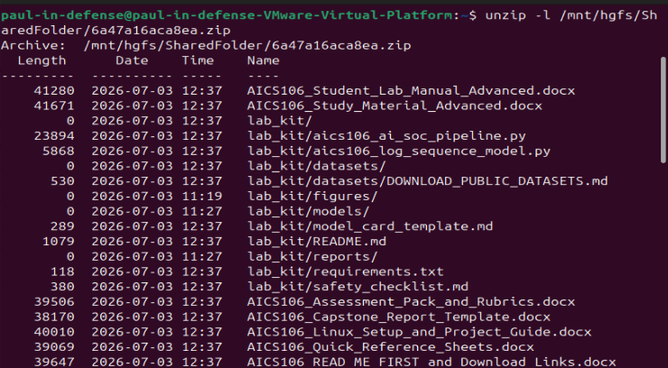

This lists the archive’s contents without extracting, to confirm the correct files (`aics106_ai_soc_pipeline.py`, `aics106_log_sequence_model.py`, `requirements.txt`, etc.) were present before committing to extraction.

**Step 3 — Create a dedicated project folder.**

```bash
mkdir -p ~/aics106
```

**Step 4 — Extract the archive directly into the project folder.**

```bash
cd ~/aics106
unzip /mnt/hgfs/SharedFolder/<zip_file>.zip
```
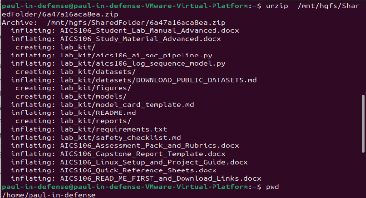

Extracting into the local filesystem (rather than working directly inside `/mnt/hgfs/`) avoids permission and file-locking issues that VMware’s shared-folder filesystem can cause with Python virtual environments.

**Step 5 — Move into the lab kit directory.**

```bash
cd ~/aics106/lab_kit
```

**Step 6 — Create and activate a Python virtual environment.**

```bash
cd ~/aics106
python3 -m venv venv
source venv/bin/activate
python -m pip install --upgrade pip wheel setuptools
```
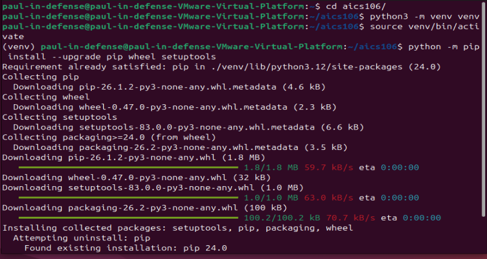

The venv isolates project dependencies from the system Python. The shell prompt shows `(venv)` once active — this must be active for every subsequent command.

**Step 7 — Install lab kit dependencies.**

```bash
cd ~/aics106/lab_kit
pip install -r requirements.txt
```
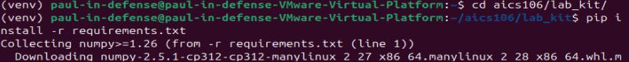
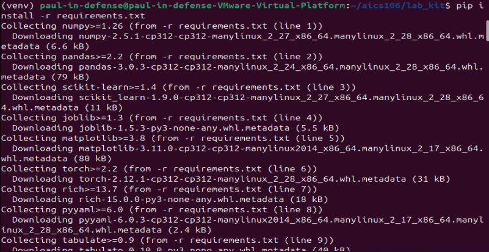
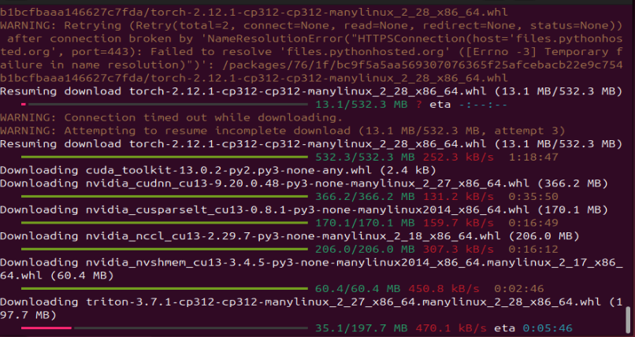
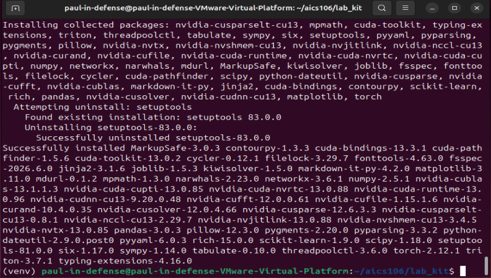

This installed all required packages: `numpy`, `pandas`, `scikit-learn`, `joblib`, `matplotlib`, `torch`, `rich`, `pyyaml`, `tabulate`.

**Step 8 — Verify the environment.**

```bash
python - <<'PY'
import sys, torch, sklearn, pandas as pd
print('Python:', sys.version)
print('PyTorch:', torch.__version__)
print('CUDA available:', torch.cuda.is_available())
print('Pandas:', pd.__version__)
print('Scikit-learn:', sklearn.__version__)
PY
```
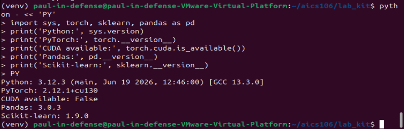

**Output:** Python, PyTorch, pandas, and scikit-learn versions printed cleanly with `CUDA available: False` (confirming CPU-only training for this run).

**Step 9 — Self-test the pipeline.**

```bash
python aics106_ai_soc_pipeline.py self-test
```
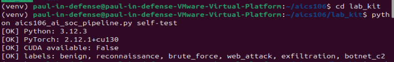

**Output:** `OK` for Python, PyTorch, and label checks — confirming the pipeline script runs correctly in this environment before any data generation or training began.

-----

### 4.2 Network Telemetry Dataset — Generation and Profiling

**Step 1 — Generate the synthetic network telemetry dataset.**

```bash
python aics106_ai_soc_pipeline.py generate --rows 30000 --out datasets/aics106_network_telemetry.csv
```

This created 30,000 labeled synthetic network-flow records across six classes.

**Step 2 — Profile the dataset.**

```bash
python aics106_ai_soc_pipeline.py profile --data datasets/aics106_network_telemetry.csv --out reports/dataset_profile.md
```
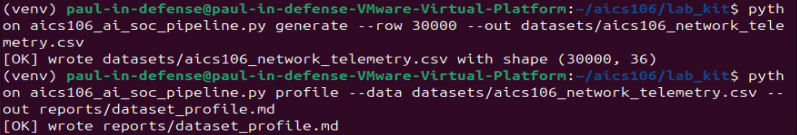

**Step 3 — Read the profile report.**

```bash
cat reports/dataset_profile.md
```
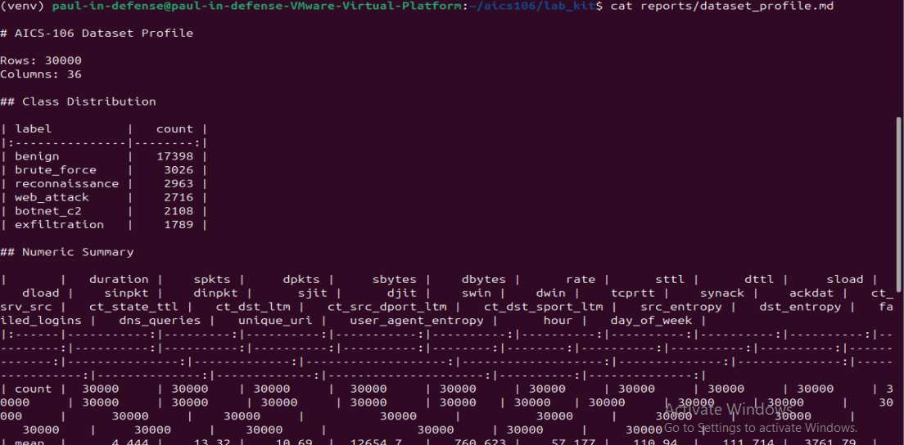
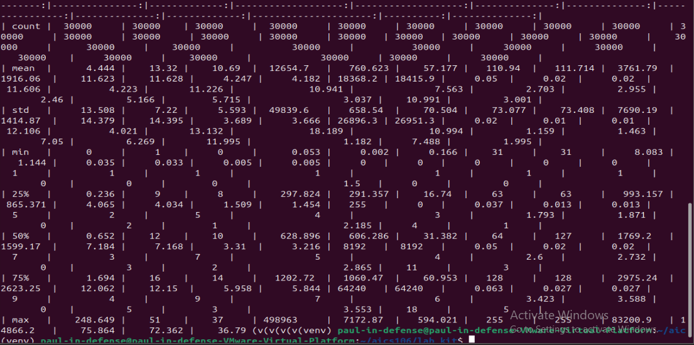

**Result — Class Distribution:**

|Label         |Count |Percentage|
|--------------|------|----------|
|benign        |17,398|58.0%     |
|brute_force   |3,026 |10.1%     |
|reconnaissance|2,963 |9.9%      |
|web_attack    |2,716 |9.1%      |
|botnet_c2     |2,108 |7.0%      |
|exfiltration  |1,789 |6.0%      |

This confirmed a **class imbalance** typical of real security data — benign traffic dominates at 58%, while the rarest attack class (exfiltration) makes up under 6%. This is the reason the course (and this project) evaluates using macro F1 and per-class recall rather than raw accuracy: a model could reach ~58% “accuracy” simply by predicting benign every time, while missing every real attack.

The dataset contained 30,000 complete rows across all numeric features (duration, packet/byte counts, rates, TCP flags, TTL values, context counters, entropy, DNS queries, unique URIs, failed logins, time-of-day) with no missing values.

-----

### 4.3 ThreatNet — Training and Evaluation

**Step 1 — Train the model.**

```bash
python aics106_ai_soc_pipeline.py train --data datasets/aics106_network_telemetry.csv --epochs 20 --model-out models/threatnet.pt
```
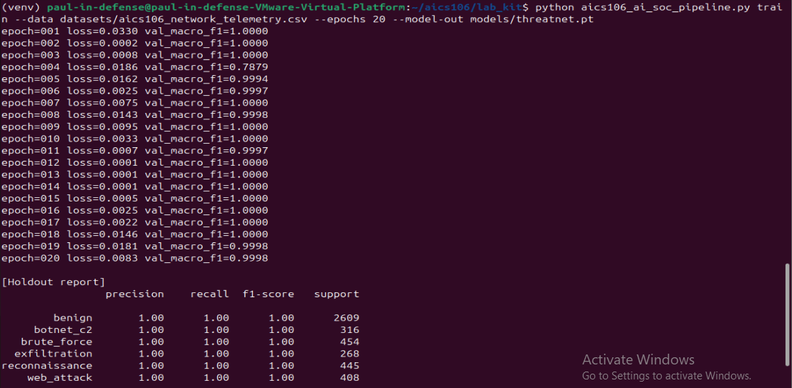
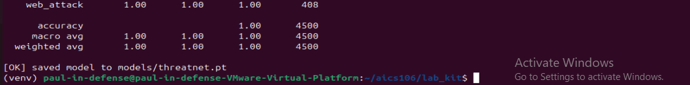

**Output:** Per-epoch training loss and validation macro F1 were printed. Loss decreased steadily, reaching near-zero (0.0001–0.0146) from epoch 12 onward, with validation macro F1 reaching 0.9997–1.0000 from epoch 6 onward. The model was saved to `models/threatnet.pt`.

**Holdout report (printed at end of training, 4,500 held-out samples):**

|Class         |Precision|Recall|F1-score|Support|
|--------------|---------|------|--------|-------|
|benign        |1.00     |1.00  |1.00    |2,609  |
|botnet_c2     |1.00     |1.00  |1.00    |316    |
|brute_force   |1.00     |1.00  |1.00    |454    |
|exfiltration  |1.00     |1.00  |1.00    |268    |
|reconnaissance|1.00     |1.00  |1.00    |445    |
|web_attack    |1.00     |1.00  |1.00    |408    |

**Step 2 — Run formal evaluation on the full dataset.**

```bash
python aics106_ai_soc_pipeline.py evaluate --data datasets/aics106_network_telemetry.csv --model models/threatnet.pt --out reports/network_eval.md
```
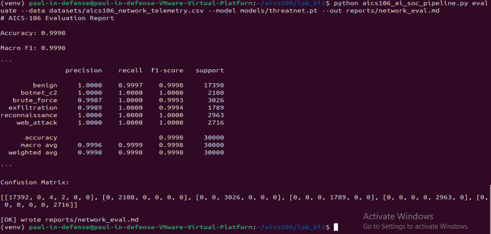

**Result:**

- Accuracy: **0.9998**
- Macro F1: **0.9998**

|Class         |Precision|Recall|F1-score|Support|
|--------------|---------|------|--------|-------|
|benign        |1.0000   |0.9997|0.9998  |17,398 |
|botnet_c2     |1.0000   |1.0000|1.0000  |2,108  |
|brute_force   |0.9987   |1.0000|0.9993  |3,026  |
|exfiltration  |0.9989   |1.0000|0.9994  |1,789  |
|reconnaissance|1.0000   |1.0000|1.0000  |2,963  |
|web_attack    |1.0000   |1.0000|1.0000  |2,716  |

**Confusion Matrix** (rows = true class, columns = predicted; order: benign, botnet_c2, brute_force, exfiltration, reconnaissance, web_attack):

```
[[17392,     0,     4,     2,     0,     0],
 [    0,  2108,     0,     0,     0,     0],
 [    0,     0,  3026,     0,     0,     0],
 [    0,     0,     0,  1789,     0,     0],
 [    0,     0,     0,     0,  2963,     0],
 [    0,     0,     0,     0,     0,  2716]]
```

See [Error Analysis](#error-analysis) for interpretation.

-----

### 4.4 Explainability

**Step 1 — Generate feature saliency explanations.**

```bash
python aics106_ai_soc_pipeline.py explain --data datasets/aics106_network_telemetry.csv --model models/threatnet.pt --samples 6 --out reports/explanations.md
```
**Step 2 — Read the explanations.**

```bash
cat reports/explanations.md
```
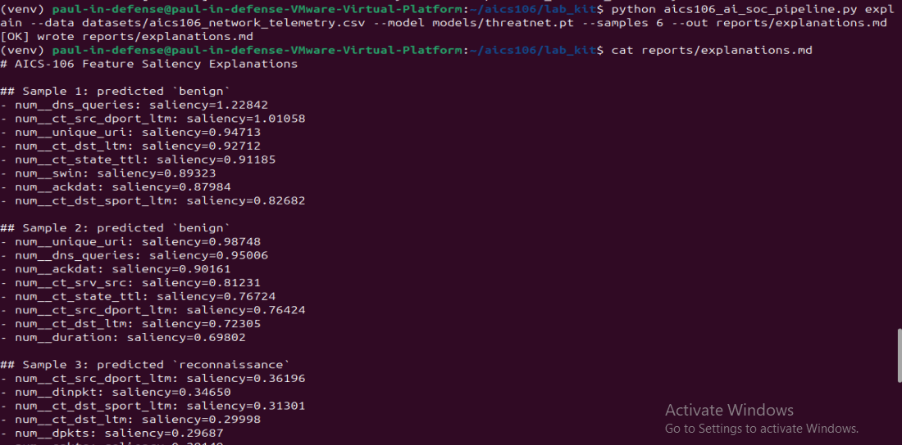
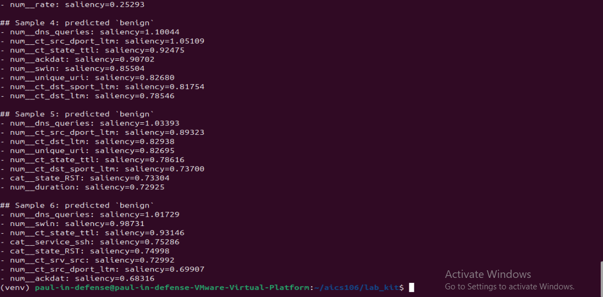

**Representative results:**

- **Sample 1 (predicted `benign`):** Top features — `num_dns_queries` (saliency 1.228), `num_ct_src_dport_ltm` (1.011), `num_unique_uri` (0.947). High DNS query volume and varied URI access patterns are consistent with normal browsing behaviour.
- **Sample 3 (predicted `reconnaissance`):** Top features — `num_ct_src_dport_ltm` (0.362), `num_dinpkt` (0.347), `num_ct_dst_sport_ltm` (0.313). These relate to distinct destination ports contacted and packet timing — consistent with scanning behaviour, where a host probes many ports/services in a short window.
- **Samples 2, 4, 5, 6 (predicted `benign`):** Consistently driven by `num_dns_queries`, `num_swin` (TCP window size), and `num_ct_state_ttl` — indicating the model relies heavily on DNS behaviour and standard TCP/TTL signatures to identify normal traffic.

These explanations are **analyst aids, not proof of causality** — a high saliency score shows the model weighted that feature heavily for this specific prediction, not that the feature *causes* the underlying behaviour.

-----

### 4.5 Linux Log Sequence Model — Generation, Training, and Demo

This stage trains a second, complementary model focused on host-level Linux authentication behaviour, using `aics106_log_sequence_model.py`.

**Step 1 — Generate the synthetic session dataset.**

```bash
python aics106_log_sequence_model.py generate --sessions 8000 --out datasets/linux_auth_sequences.jsonl
```

This created 8,000 labeled session records, each an ordered sequence (up to 20 events) drawn from an 11-event vocabulary (`login_success`, `login_fail`, `sudo_success`, `sudo_fail`, `new_user`, `ssh_key_added`, `cron_modified`, `service_restart`, `session_closed`, `file_access_denied`, `unknown_binary`), across four classes.

**Step 2 — Train the GRU model.**

```bash
python aics106_log_sequence_model.py train --data datasets/linux_auth_sequences.jsonl --epochs 12 --model-out models/linux_log_gru.pt
```
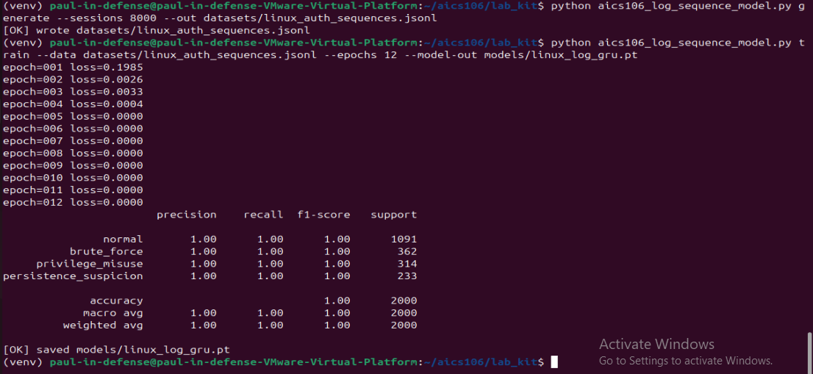

**Architecture:** A bidirectional 2-layer GRU with a 48-dimensional padding-aware embedding layer, hidden size 96 per direction (192 concatenated), dropout 0.15 between GRU layers, followed by a classification head (Linear 192→96 → GELU → Dropout 0.15 → Linear 96→4). An explicit stratified 75/25 train-test split was used (`random_state=106`), and the model was trained with the AdamW optimizer (learning rate 2e-3, weight decay 1e-4), cross-entropy loss, batch size 128.

**Output:** Training loss dropped from 0.1985 (epoch 1) to 0.0000 by epoch 5, remaining there through epoch 12.

**Classification report (2,000-session stratified holdout):**

|Class                |Precision|Recall|F1-score|Support|
|---------------------|---------|------|--------|-------|
|normal               |1.00     |1.00  |1.00    |1,091  |
|brute_force          |1.00     |1.00  |1.00    |362    |
|privilege_misuse     |1.00     |1.00  |1.00    |314    |
|persistence_suspicion|1.00     |1.00  |1.00    |233    |

Overall accuracy and macro/weighted averages: **1.00** across all 2,000 held-out sessions. Model saved to `models/linux_log_gru.pt`.

**Step 3 — Run a standalone demo of the trained sequence model.**

```bash
python aics106_log_sequence_model.py demo --model models/linux_log_gru.pt --events 25
```
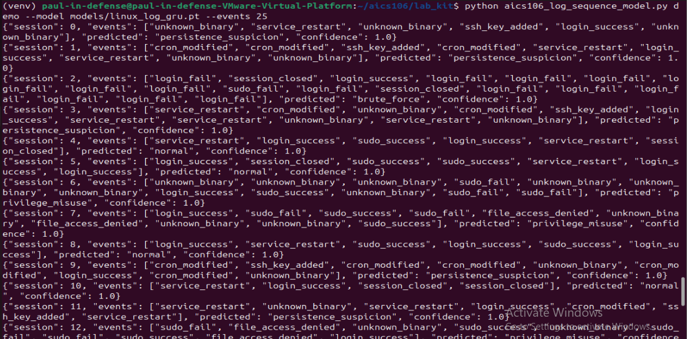
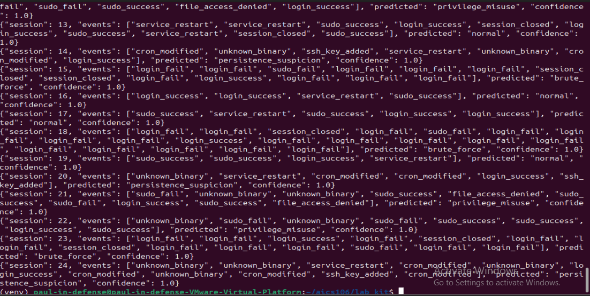

This streamed 25 synthetic sessions through the trained model and printed live predictions. Examples: a sequence of repeated `login_fail` events followed by `login_success` was correctly classified as `brute_force` (confidence 1.0); a sequence containing `ssh_key_added` followed by `cron_modified` was correctly classified as `persistence_suspicion` (confidence 1.0) — both consistent with the intended semantics of those classes.

-----

### 4.6 Live AI SOC Demo

**Step 1 — Run the live-style detector.**

```bash
python aics106_ai_soc_pipeline.py live-demo --model models/threatnet.pt --events 80 --delay 0.05 --out reports/live_incidents.jsonl
```
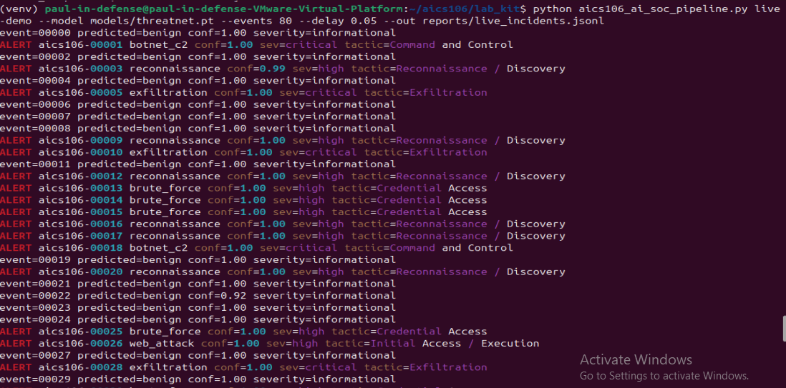
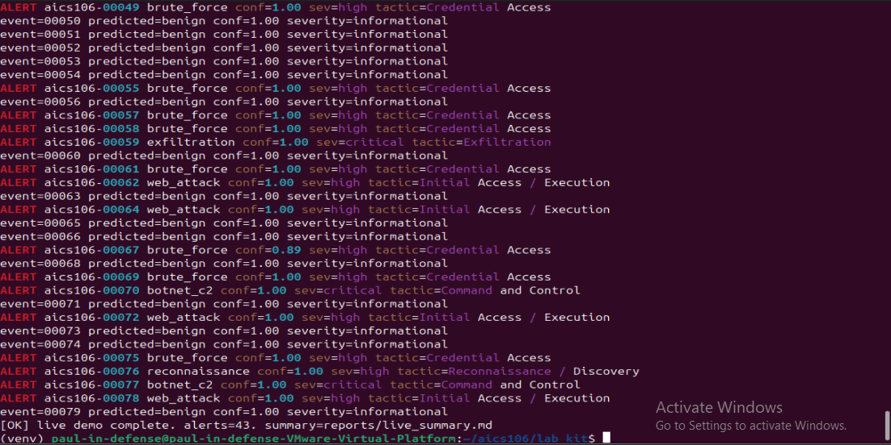

This streamed 80 simulated events through the trained ThreatNet model with a small delay between each, writing each as an incident record to `reports/live_incidents.jsonl`.

**Step 2 — Summarize the incidents.**

```bash
python aics106_ai_soc_pipeline.py summarize-incidents --infile reports/live_incidents.jsonl --out reports/live_summary.md
```

**Step 3 — Read the summary.**

```bash
cat reports/live_summary.md
```
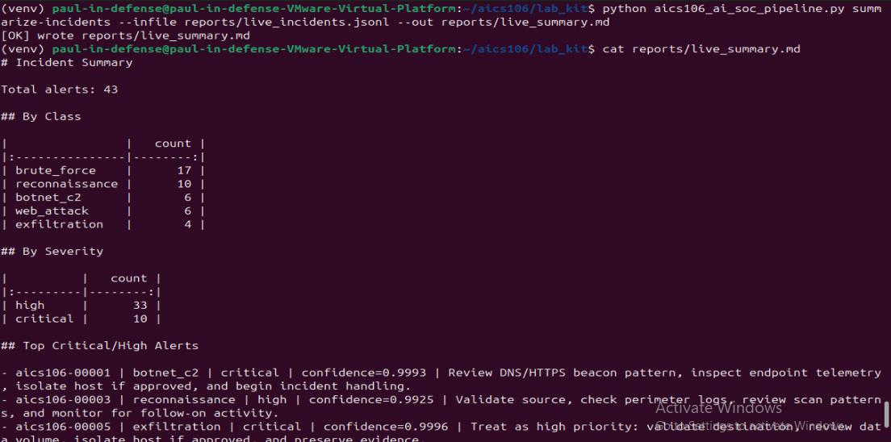
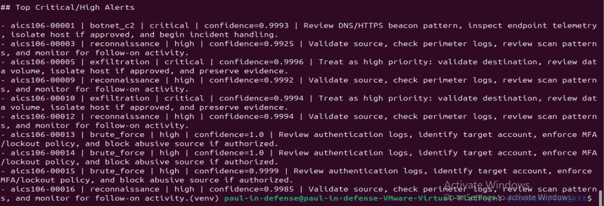

**Result — Severity breakdown:** 33 high-severity alerts, 10 critical-severity alerts (out of 80 streamed events).

**Example alerts:**

- **aics106-00001** — `botnet_c2`, **critical**, confidence 0.9993. Recommended action: review DNS/HTTPS beaconing pattern, inspect endpoint telemetry, isolate host if approved. Reflects a classic C2 pattern — periodic outbound connections consistent with malware “phoning home” to a controller.
- **aics106-00005** — `exfiltration`, **critical**, confidence 0.9994. Recommended action: validate destination, review data volume, isolate host if approved, preserve evidence. Reflects unusually large outbound data transfer, consistent with data theft.
- **aics106-00013** — `brute_force`, **high**, confidence 1.0. Recommended action: review authentication logs, identify target account, enforce MFA/lockout policy, block abusive source if authorized. Reflects a classic repeated-failed-login pattern.

Each incident record included: `timestamp`, `event_id`, `predicted_class`, `confidence`, `severity`, `top_features`, `evidence_summary`, `recommended_action`, `model_version`, `analyst_status` — matching the minimum incident report fields specified in the course quick reference.

-----

## Results Summary

|Model        |Task                                |Records              |Macro F1|Accuracy|
|-------------|------------------------------------|---------------------|--------|--------|
|ThreatNet    |6-class network flow classification |30,000               |0.9998  |0.9998  |
|Linux Log GRU|4-class auth sequence classification|8,000 (2,000 holdout)|1.00    |1.00    |

## Error Analysis

**ThreatNet:** Of 30,000 samples, only 6 were misclassified — all 6 were true `benign` samples predicted as either `brute_force` (4 cases) or `exfiltration` (2 cases). No attack class was ever confused with another attack class, and no attack was ever misclassified as benign (zero false negatives across all attack types in this test).

**Linux Log GRU:** Zero misclassifications across the entire 2,000-session holdout set.

This near-perfect separation is a direct consequence of using a synthetic data generator: each class was generated from a distinct, largely non-overlapping template of feature/event patterns, making the classes far more separable than real-world traffic — where attacker behaviour often deliberately mimics benign patterns to evade detection. **These results should be read as a ceiling on synthetic data performance, not as evidence of real-world detection capability.**

## Risk, Privacy, Drift, and Limitations

- **Synthetic data ceiling:** All results in this report come from a local synthetic generator with non-overlapping class templates. The near-perfect scores (macro F1 ≈ 1.00 on both models) reflect the separability of this synthetic data, not real-world detection capability. Real traffic contains overlapping, noisy, and adversarially-evasive patterns that synthetic generators do not model.
- **No public dataset validation:** This project uses only the synthetic generator; results have not been cross-validated against a public benchmark dataset (e.g. UNSW-NB15, CIC-IDS2017), which would be required before drawing any conclusions about real-world generalization.
- **Concept and data drift:** Attacker behaviour and normal traffic patterns evolve over time. A model trained on a static synthetic snapshot will not adapt to new attack techniques or changing baseline traffic without retraining and ongoing monitoring.
- **Adversarial evasion:** No adversarial robustness testing was performed. A motivated attacker could shape traffic to resemble benign patterns and evade detection, particularly given how cleanly separable the current training data is.
- **Privacy considerations:** Although only synthetic data was used here, any real deployment would involve logs containing usernames, IP addresses, and device identifiers, requiring strict access control, data minimization, and compliance with applicable privacy policy before ingestion.
- **Calibration untested:** While confidence scores were reported and appear high, no formal calibration analysis (e.g. reliability diagrams) was performed to confirm that a 0.99 confidence score genuinely corresponds to 99% real-world correctness.
- **No live network/production connection:** All testing was performed in an isolated lab environment on synthetic, offline data. The detector was never connected to a live network or production system, consistent with course safety and ethics requirements.

## Deployment Recommendation

This system is **not recommended for production deployment** in its current form. It should be treated as a working proof-of-concept demonstrating the full AI SOC pipeline (data generation, training, evaluation, explainability, and live-style incident reporting) rather than a validated detector.

Before any real deployment, the following would be required:

1. Retraining and evaluation on at least one public benchmark dataset (UNSW-NB15, CIC-IDS2017, or CICIoT2023) to test generalization beyond synthetic patterns.
1. Adversarial robustness testing.
1. Confidence calibration analysis.
1. A defined drift-monitoring and retraining schedule.
1. Integration with human-in-the-loop analyst review rather than automated response.

In its current state, the system is best suited as a training/demonstration tool and as a foundation for further, properly validated research.

## References

- Canadian Institute for Cybersecurity, *CIC-IDS2017 Dataset*. https://www.unb.ca/cic/datasets/ids-2017.html
- UNSW-NB15 Dataset, University of New South Wales. https://research.unsw.edu.au/projects/unsw-nb15-dataset
- Canadian Institute for Cybersecurity, *CICIoT2023 Dataset*. https://www.unb.ca/cic/datasets/iotdataset-2023.html
- MITRE ATT&CK Framework. https://attack.mitre.org/
- PyTorch Documentation, “Get Started Locally.” https://pytorch.org/get-started/locally/
- Zeek Network Security Monitor. https://zeek.org/
- Suricata. https://suricata.io/
- AICS-106 Study Material and Assessment Pack, ICDFA AI-Driven Cybersecurity and Digital Forensics Fellowship.