# ForensicGraph AI Investigation Workbench — Capstone Report

**Case:** case_alpha (synthetic training-data phishing incident)
**Course:** AICS-110 — AI-Enhanced Digital Forensics
**Programme:** ICDFA AI-Driven Cybersecurity and Digital Forensics Fellowship

-----

## 1. Environment Setup

**Goal:** stand up the ForensicGraph AI Investigation Workbench project on a Linux VM and prepare it for the case investigation.

Created a dedicated working directory for the entire course project,
Moved into that directory so all subsequent work stays contained,
Copied the course pack ZIP from the VMware shared folder (`/mnt/hgfs/SharedFolder`) into the working directory, rather than operating on the shared mount directly and confirmed the ZIP copied successfully.

```bash
mkdir -p AICS110
cd AICS110
cp /mnt/hgfs/SharedFolder/AICS110.zip .
ls
```
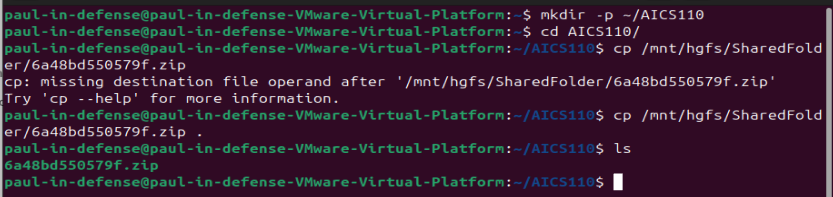

Extracted the course pack, which included `ForensicGraphAI_Project/` (the actual project code) alongside course documentation and the `Official_CKIM2024_Lab_Source/` reference material.
```bash
unzip AICS110.zip
```
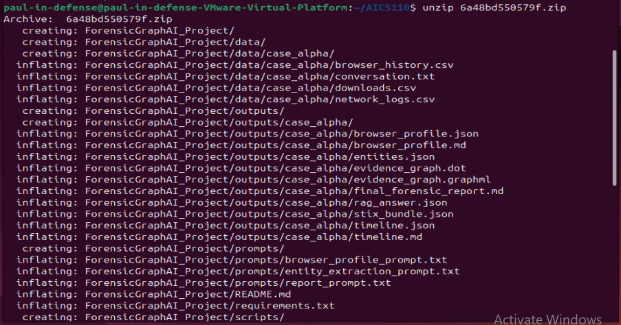
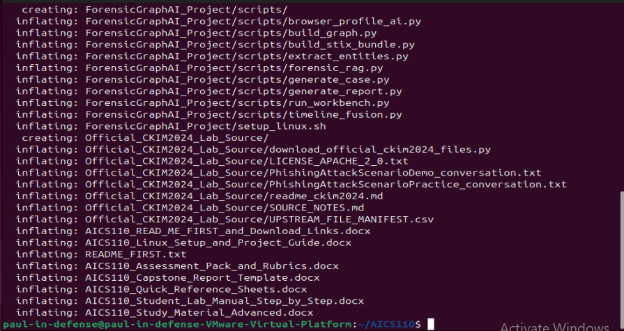

Entered the project folder and confirmed its contents: `data/`, `outputs/`, `prompts/`, `scripts/`, `README.md`, `requirements.txt`, `setup_linux.sh`.
```bash
cd ForensicGraphAI_Project
ls
```
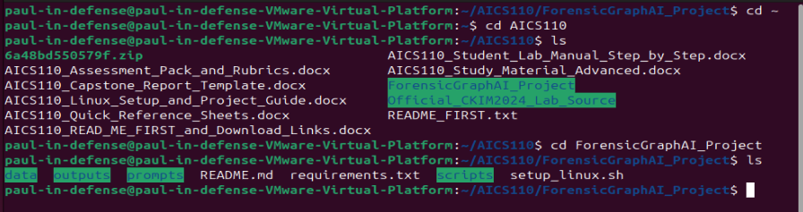

Ran the project’s setup script, which created a Python virtual environment (`.venv`) and installed all required dependencies.
```bash
bash setup_linux.sh
```
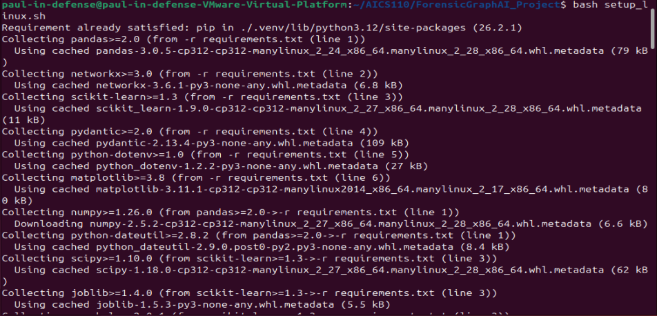
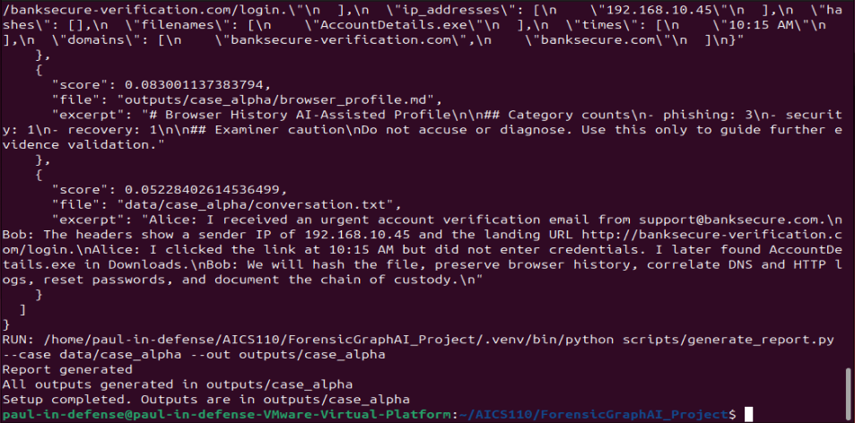

Activated the virtual environment. Every script from this point forward was run inside this environment (shell prompt shows `(.venv)`).
```bash
source .venv/bin/activate
```
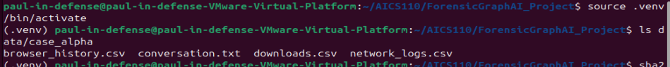

**Environment confirmed:**

|Item    |Value                     |
|--------|--------------------------|
|OS      |Ubuntu 24.04.3 LTS (noble)|
|Python  |3.12.3                    |
|Platform|VMware Workstation VM     |

**Project README confirmed the pipeline’s safety design:** it is a safe, offline, deterministic pipeline using no real evidence from real people. An optional LLM-backed mode exists (`prompts/` folder) but is not enabled by default, and cloud LLM use is only permitted with sanitized, authorized data.


-----

## 2. Lab 1 — Environment and Case Creation

**Goal:** confirm the case evidence is present and establish a chain-of-custody record by hashing every source file before any analysis begins.

Confirmed all four expected evidence files were present: `conversation.txt`, `browser_history.csv`, `downloads.csv`, `network_logs.csv`.
Generated a SHA256 cryptographic hash of every evidence file. This is the standard forensic practice of hashing evidence *before* any analysis, so any later question about whether a file was altered can be answered by re-hashing and comparing.
Redirected the same command’s output into `evidence_hashes_lab1.txt` so the hash record is preserved outside the terminal scrollback, for direct inclusion in the report.

```bash
ls data/case_alpha
sha256sum data/case_alpha/*
sha256sum data/case_alpha/* > ~/AICS110/evidence_hashes_lab1.txt
```

**Output — Evidence Hashes:**

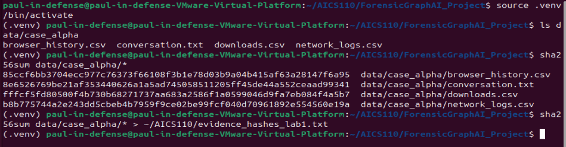

|File               |SHA256                                                            |
|-------------------|------------------------------------------------------------------|
|browser_history.csv|`85ccf6bb3704ecc977c76373f66108f3b1e78d03b9a04b415af63a28147f6a95`|
|conversation.txt   |`8e6526769be21af353440626a1a5ad745058511205ff45de44a552ceaad99341`|
|downloads.csv      |`fffcf5fd80500f4b730b68271737aa683a2586f1a0599046d9fa7eb084f4a5b7`|
|network_logs.csv   |`b8b775744a2e243dd5cbeb4b7959f9ce02be99fcf040d70961892e554560e19a`|


-----

## 3. Lab 2 — Evidence Entity Extraction

**Goal:** run AI-assisted entity extraction over the case evidence, then manually verify every extracted field against the primary source text — the core “trust but verify” exercise of the course.

To extract the entities, `extract_entities.py` was run against the case folder, writing its output to `outputs/case_alpha/entities.json`. This script uses pattern-based (regex-style) extraction — not a generative LLM — to pull out emails, URLs, IP addresses, file hashes, filenames, timestamps, and domains from the evidence.

```bash
python scripts/extract_entities.py --case data/case_alpha --out outputs/case_alpha
```
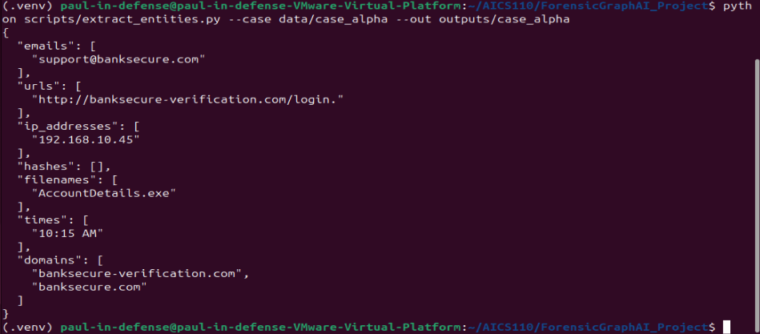

Displayed the original source conversation, so every extracted entity could be checked by hand against the actual text — line by line, not trusted at face value.
```bash
cat data/case_alpha/conversation.txt
```
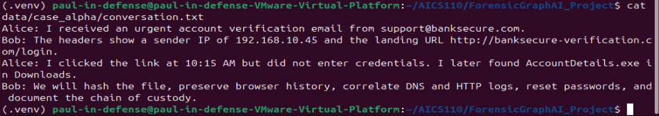

**Output — entities.json:**

```json
{
  "emails": ["support@banksecure.com"],
  "urls": ["http://banksecure-verification.com/login."],
  "ip_addresses": ["192.168.10.45"],
  "hashes": [],
  "filenames": ["AccountDetails.exe"],
  "times": ["10:15 AM"],
  "domains": ["banksecure-verification.com", "banksecure.com"]
}
```

**Manual validation table (Correct / Incorrect / Missing / Needs Review):**

|Field     |Extracted Value                          |Verdict                                                                                                             |
|----------|-----------------------------------------|--------------------------------------------------------------------------------------------------------------------|
|Email     |support@banksecure.com                   |**Correct** — exact match in source                                                                                 |
|URL       |http://banksecure-verification.com/login.|**Correct**, but see note below on the trailing period                                                              |
|IP address|192.168.10.45                            |**Correct** — exact match in source                                                                                 |
|Filename  |AccountDetails.exe                       |**Correct** — exact match in source                                                                                 |
|Timestamp |10:15 AM                                 |**Correct** — exact match in source                                                                                 |
|Domain    |banksecure-verification.com              |**Correct** — correctly derived from the URL                                                                        |
|Domain    |banksecure.com                           |**Needs Review** — derived from the sender’s email address, not a domain independently/separately stated in the text|
|Hashes    |none extracted                           |**Correct** — no hash value appears anywhere in conversation.txt                                                    |

**Missing:** the entity schema used by `extract_entities.py` has no field for *actions*. Bob’s proposed investigative actions — hash the file, preserve browser history, correlate DNS and HTTP logs, reset passwords, document chain of custody — are relevant “action” entities per the course’s own entity model (see Study Material: “Action” is a listed entity type), but were not captured. These were recorded manually.

**Data-quality issue found:** the extracted URL carries a trailing period (`login.`) directly copied from the end of the source sentence (”…the landing URL http://banksecure-verification.com/login.”). This is a punctuation-capture artifact, not a real part of the URL, and it persists downstream into the STIX bundle (see Lab 4).


-----

## 4. Lab 3 — Forensic Knowledge Graph Reconstruction

**Goal:** build a graph structure linking the extracted entities and evidence sources, then manually inspect the graph to confirm it’s meaningful and explains the case.

Ran this commands
```bash
python scripts/build_graph.py --case data/case_alpha --out outputs/case_alpha
ls outputs/case_alpha
cat outputs/case_alpha/evidence_graph.dot
```
 `build_graph.py` reads the case evidence and entities, and constructs a graph connecting the case, the evidence entities, and the relationships between them (e.g., “contains”, “downloaded_from”, “has_hash”). It writes two output formats: `evidence_graph.dot` (Graphviz format) and `evidence_graph.graphml` (importable into graph-visualization tools).
 `ls outputs/case_alpha` confirmed the outputs were written. At this point the `outputs/case_alpha/` folder already contained several files from a prior full-pipeline run — `stix_bundle.json`, `browser_profile.md/json`, `timeline.md/json`, `rag_answer.json`, and `final_forensic_report.md` — which is expected; running each lab script individually regenerates and overwrites the corresponding file.
 `cat evidence_graph.dot` displayed the full graph in DOT format for manual inspection.

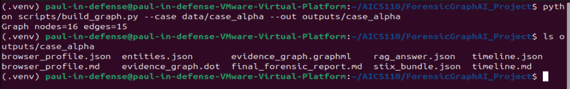
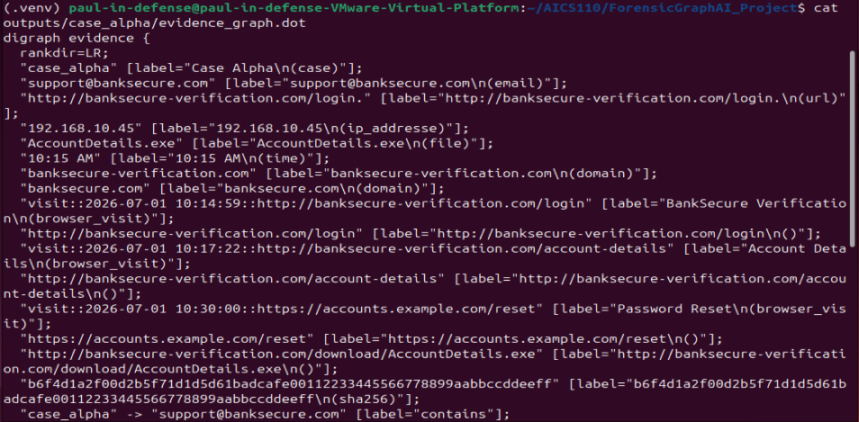
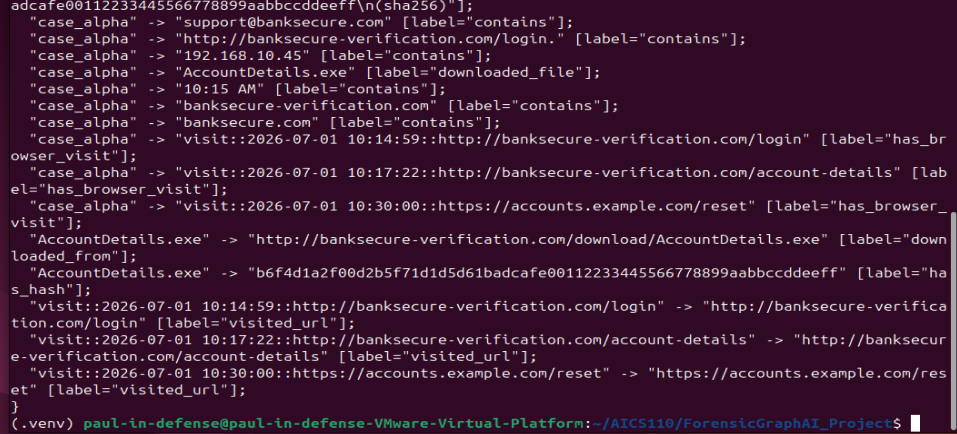


The `.graphml` file was separately imported into **yEd** to visually confirm the graph structure. this was done firstly by copying the graphml file into our SharedFolder
```bash
cp outputs/case_alpha/evidence_graph.graphml /mnt/hgfs/SharedFolder
```
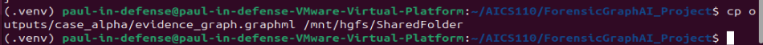

Then checking the shared folder to view the graphml in the yEd graph viewer.

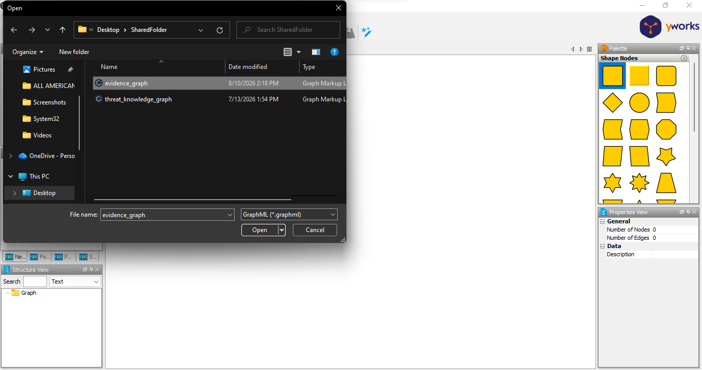
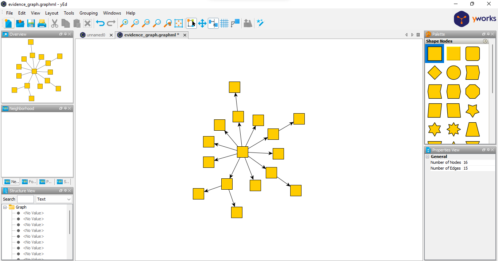


**Knowledge Graph Findings**

Five meaningful relationship edges identified:

1. `case_alpha → support@banksecure.com` [contains] — anchors the phishing sender directly to the case.
1. `case_alpha → http://banksecure-verification.com/login` [contains] — ties the malicious landing page to the case.
1. `AccountDetails.exe → http://.../download/AccountDetails.exe` [downloaded_from] — the strongest edge in the graph: directly links the suspicious executable to the exact URL it was downloaded from.
1. `AccountDetails.exe → b6f4d1a2f00d2b5f71d1d5d61...` [has_hash] — associates the file with a specific SHA256 for identification.
1. `visit::10:14:59::.../login → http://.../login` [visited_url] — confirms the browser visit at 10:14:59 corresponds to the phishing login page.

**A new finding surfaced only by the graph, not by Lab 2’s flat entity list:** a browser visit to `https://accounts.example.com/reset` at 10:30:00 — a password-reset page on a domain *separate* from the phishing infrastructure. This did not appear anywhere in `entities.json`, because the entity extractor works only from `conversation.txt` while the graph builder pulls in the richer `browser_history.csv` data as well. This is an important validation lesson: two AI tools drawing from different evidence sources produced different completeness, and only cross-checking both caught the gap.

**Why the graph helps the case:** it visually ties the sender, the malicious URL, the downloaded file, and the file’s hash into one connected structure that an examiner (or a jury, in a real case) can follow without reading raw logs line by line. The graph also exposed the additional browser visit that flat entity extraction missed.

-----

## 5. Lab 4 — STIX-Style Evidence Modelling

**Goal:** convert confirmed indicators into a simplified STIX-style bundle, understand the format’s purpose for structured threat-intelligence sharing, and identify where the simplified format falls short of real STIX 2.1.

This command was ran
```bash
python scripts/build_stix_bundle.py --out outputs/case_alpha
```
`build_stix_bundle.py` reads the case evidence and generates STIX-style `indicator` objects — a simplified version of the STIX 2.1 open standard used across the cybersecurity industry to share threat intelligence in a structured, machine-readable format.
The script printed a `DeprecationWarning` about `datetime.datetime.utcnow()` being deprecated in favor of timezone-aware datetime objects. This is a Python library warning about the script’s internal code style — it does not affect the correctness of the output and can be safely ignored, though it’s worth flagging as a maintenance item for whoever maintains this script.

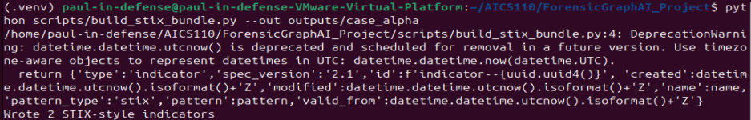

Then this was ran to display the generated bundle

```bash
cat outputs/case_alpha/stix_bundle.json
```
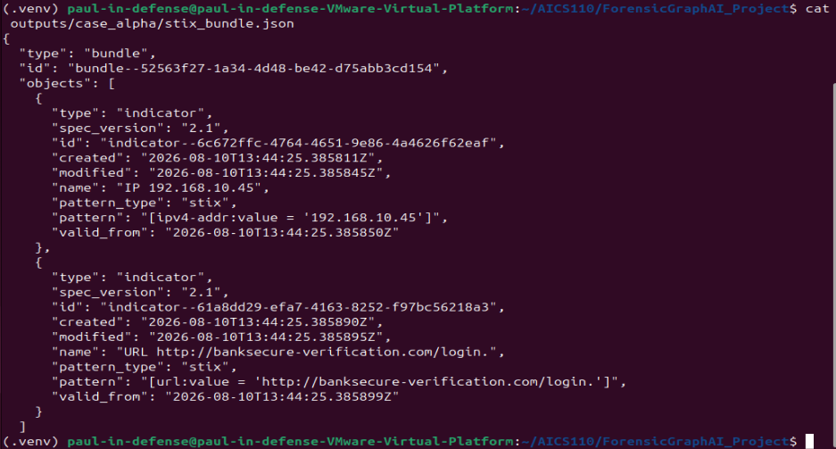


**STIX-Style Indicator Summary**

|Indicator|Pattern                                                    |Notes                                                   |
|---------|-----------------------------------------------------------|--------------------------------------------------------|
|IP       |`[ipv4-addr:value = '192.168.10.45']`                      |Consistent with entities.json and the graph             |
|URL      |`[url:value = 'http://banksecure-verification.com/login.']`|Carries the trailing-period artifact identified in Lab 2|

**Limitation identified:** the trailing period baked into the URL pattern value means a real STIX-consuming tool doing an exact string match against network traffic could fail to match the actual URL (`.../login`, no trailing dot). This is a concrete example of an uncorrected AI extraction error propagating downstream into a second AI-generated artifact.

**Coverage gap identified:** only 2 indicators were generated — IP and URL. **No hash indicator was produced**, despite the knowledge graph (Lab 3) clearly containing a SHA256 hash for `AccountDetails.exe`. A complete STIX bundle for this case should include a `file:hashes.'SHA-256'` indicator as well. This is a real limitation of `build_stix_bundle.py`‘s current scope, not a data problem — the hash *was* available, the script simply doesn’t pull from it.

**Comparison to full STIX 2.1:** this simplified output captures only `type`, `pattern`, `pattern_type`, and `valid_from`. Real STIX 2.1 indicator objects typically also include `labels`/`indicator_types`, `kill_chain_phases`, `confidence` scoring, and `relationship` objects linking indicators to other STIX Domain Objects (e.g., linking this URL indicator to a `malware` or `threat-actor` object). None of that relational or contextual richness is present here.

**Indicator-to-investigative-action mapping:**

- IP indicator (192.168.10.45) → block/monitor this IP at the network perimeter firewall.
- URL indicator (banksecure-verification.com/login) → add the domain to the web proxy/DNS blocklist.

-----

## 6. Lab 5 — Browser History AI-Assisted Profiling

**Goal:** categorize browser-visit evidence using AI assistance, while strictly avoiding any accusation, diagnosis, or inference of user intent — evidence description only.

**Commands run:**

```bash
python scripts/browser_profile_ai.py --case data/case_alpha --out outputs/case_alpha
cat outputs/case_alpha/browser_profile.md
```
`browser_profile_ai.py` reads `browser_history.csv` and sorts each visited URL into categories (e.g., phishing, security, recovery), then writes both a human-readable Markdown summary (`browser_profile.md`) and the underlying structured data (`browser_profile.json`).
`cat browser_profile.md` displayed the summary — category counts plus an explicit examiner-caution statement.

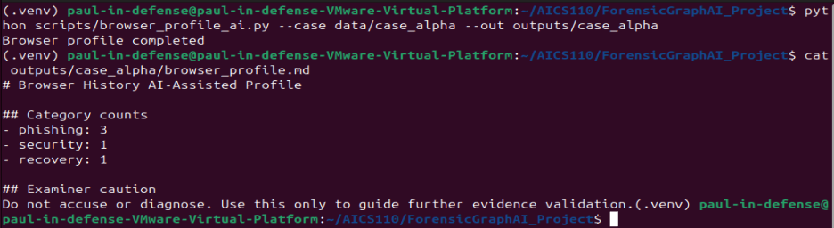

The raw evidence file, `browser_profile.json`, was then checked separately to confirm exactly which URLs/timestamps were tied to each category — this step is essential because the `.md` summary only shows aggregate counts, not the row-level mapping. This check confirmed we only have **3 evidence rows, not 5** — the category counts come from overlapping tags on the same 3 visits, not from 5 separate visits.

```bash
cat outputs/case_alpha/browser_profile.json
```
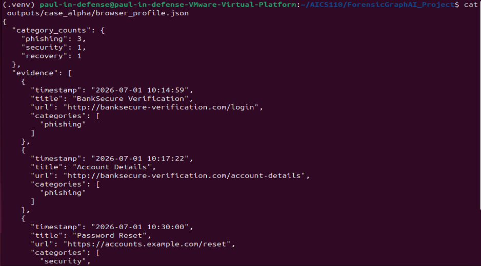
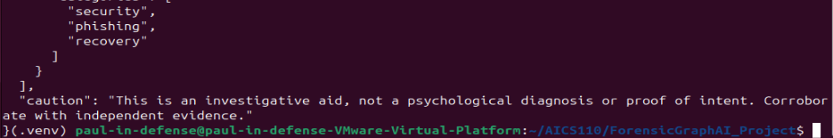


**Browser-History Profile with Ethical Caution**

Browser history for case_alpha shows three recorded visits on 2026-07-01:

|Timestamp|Title                  |URL                                        |Categories        |
|---------|-----------------------|-------------------------------------------|------------------|
|10:14:59 |BankSecure Verification|banksecure-verification.com/login          |phishing          |
|10:17:22 |Account Details        |banksecure-verification.com/account-details|phishing          |
|10:30:00 |Password Reset         |accounts.example.com/reset                 |security, recovery|

The apparent count of “5” category tags in the summary comes from the reset visit carrying two category labels (security *and* recovery) — not from 5 separate visits. This was only caught by checking `browser_profile.json` directly rather than trusting the `.md` summary’s aggregate counts at face value.

As the tool’s own output states: *“This is an investigative aid, not a psychological diagnosis or proof of intent. Corroborate with independent evidence.”* Consistent with that caution, no conclusion is drawn here about user awareness, intent, or culpability — only what was visited and when.

**Three corroborating evidence sources to request next:**

1. DNS resolution logs for `accounts.example.com` — to confirm it is the legitimate password-reset domain and not a second, separate spoofed domain.
1. Browser download-permission or click telemetry — to confirm whether `AccountDetails.exe` was actively clicked by the user or downloaded automatically/silently.
1. System or account audit logs — to confirm whether the password reset at 10:30:00 actually completed successfully.

-----

## 7. Lab 6 — Timeline Fusion

**Goal:** merge all evidence sources (browser visits, the download event, and the network log) into a single chronological sequence, to reconstruct the full incident story in time order.

**Commands run:**

```bash
python scripts/timeline_fusion.py --case data/case_alpha --out outputs/case_alpha
cat outputs/case_alpha/timeline.md
```

`timeline_fusion.py` pulls timestamped events from every evidence source — `browser_history.csv`, `downloads.csv`, and `network_logs.csv` — and merges them into one unified, chronologically sorted sequence. This is what allows an examiner to see the full attack story unfold in time, rather than as three disconnected logs.

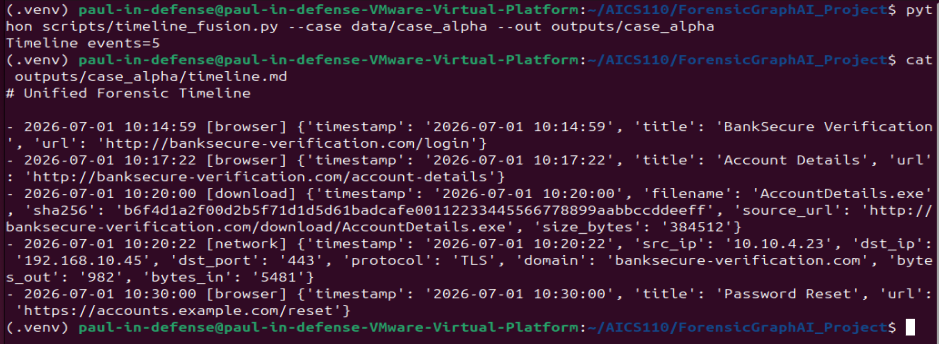


**Timeline Reconstruction**

|Time    |Type    |Detail                                                                                                                                                 |
|--------|--------|-------------------------------------------------------------------------------------------------------------------------------------------------------|
|10:14:59|browser |Visited BankSecure Verification login page                                                                                                             |
|10:17:22|browser |Visited Account Details page                                                                                                                           |
|10:20:00|download|`AccountDetails.exe` downloaded (384,512 bytes, SHA256 `b6f4d1a2f00d2b5f71d1d5d61ba...`) from `banksecure-verification.com/download/AccountDetails.exe`|
|10:20:22|network |TLS connection: src `10.10.4.23` → dst `192.168.10.45:443`, resolving to `banksecure-verification.com`, 982 bytes out / 5481 bytes in                  |
|10:30:00|browser |Visited Password Reset page on `accounts.example.com`                                                                                                  |

**Cross-check against prior labs:** the download event’s SHA256 hash exactly matches the hash recorded in the Lab 3 knowledge graph — no drift between the two independently generated outputs. The network log’s destination IP (`192.168.10.45`) exactly matches the IP identified in Lab 2’s entity extraction, the Lab 3 graph, and the Lab 4 STIX indicator — this is genuine independent corroboration of the same indicator across three separate evidence sources (conversation text → entity extraction; network log → timeline), which is a strong validation point.

**Most important 10-minute window: 10:14:59 – 10:20:22**

> The most significant window in this case runs from 10:14:59 to 10:20:22. It begins with the user visiting the spoofed “BankSecure Verification” login page at 10:14:59, followed three minutes later by a visit to an “Account Details” page on the same domain at 10:17:22. At 10:20:00, the file AccountDetails.exe (384,512 bytes, SHA256 `b6f4d1a2f00d2b5f71d1d5d61...`) was downloaded from that same domain, and 22 seconds later a network log confirms a TLS connection from the internal host (10.10.4.23) to 192.168.10.45 on port 443, resolving to banksecure-verification.com. Together, these three independent evidence sources — browser history, download log, and network log — corroborate a single continuous sequence: the user browsed to the phishing site, downloaded an executable from it, and the device made an outbound network connection to that same infrastructure within seconds.

The 10:30:00 password-reset visit falls outside this critical window and most plausibly represents a remediation step taken after the compromise activity — consistent with Bob’s stated plan in the original conversation to “reset passwords” — though this has not been independently confirmed (see corroborating sources requested in Lab 5).

-----

## 8. Lab 7 — Local Forensic Retrieval Assistant (RAG)

**Goal:** ask the case data plain-English questions and evaluate whether the retrieval assistant’s answers are genuinely evidence-backed, or whether they surface irrelevant/incorrect material.

**Commands run:**

```bash
python scripts/forensic_rag.py --case data/case_alpha --out outputs/case_alpha --question "Which evidence supports phishing?"
cat outputs/case_alpha/rag_answer.json
```
`forensic_rag.py` lets an examiner ask the case data plain-English questions; it returns a ranked list of evidence excerpts with relevance scores and file references, functioning like a mini search engine scoped to the case output files. The lab requires three questions be run.

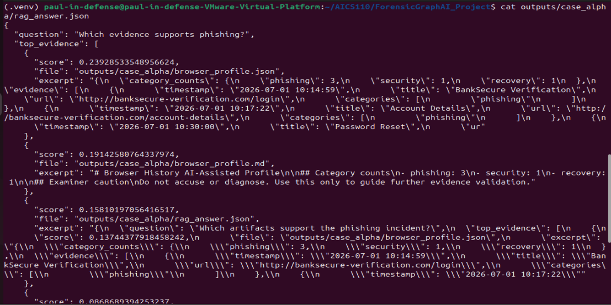
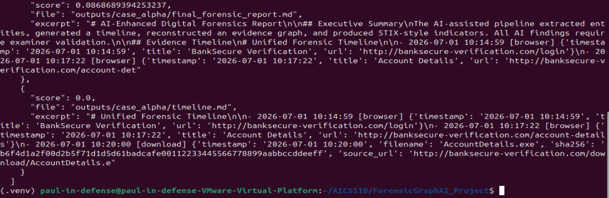

Because each run **overwrites** `rag_answer.json`, each answer was copied to a uniquely named file (`rag_answer_q1_phishing.json`, etc.) immediately after being reviewed, before running the next question — otherwise the earlier answers would be lost.
```bash
cp outputs/case_alpha/rag_answer.json outputs/case_alpha/rag_answer_q1_phishing.json
```
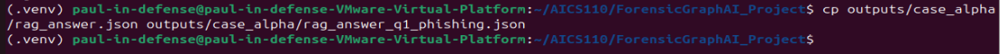

```bash
python scripts/forensic_rag.py --case data/case_alpha --out outputs/case_alpha --question "What file was downloaded?"
```
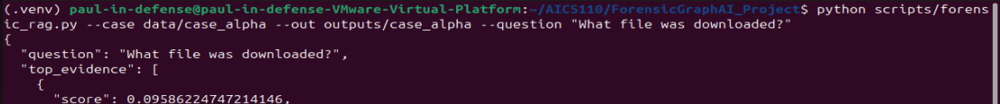

```bash
cp outputs/case_alpha/rag_answer.json outputs/case_alpha/rag_answer_q2_download.json
```
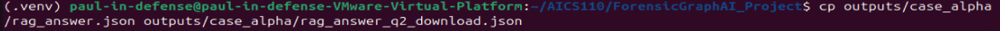

```bash
cat outputs/case_alpha/rag_answer_q2_download.json
```
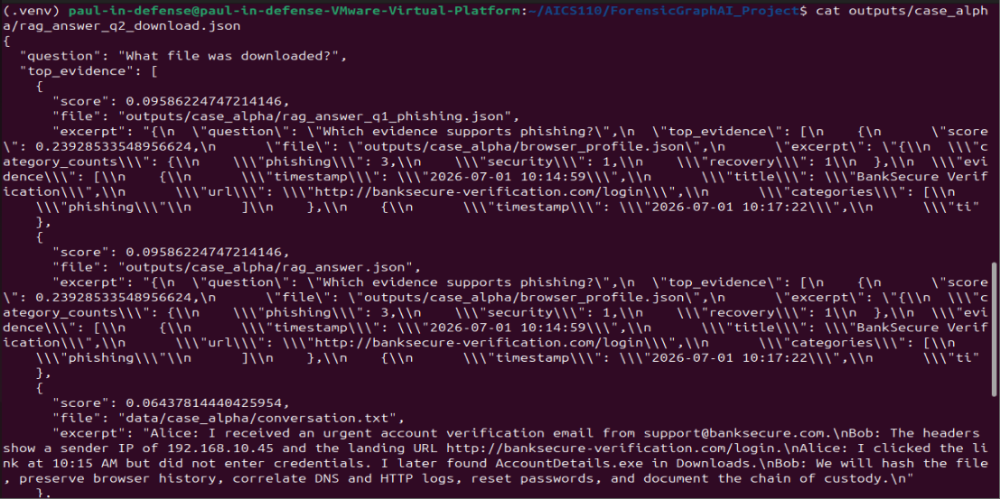
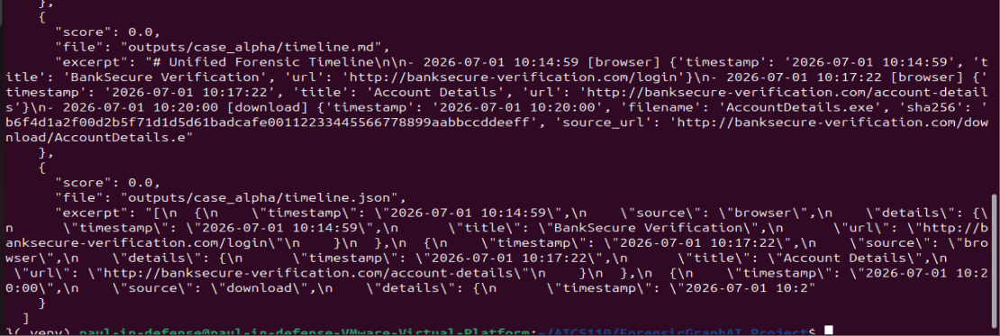

```bash
python scripts/forensic_rag.py --case data/case_alpha --out outputs/case_alpha --question "Which domains are suspicious?"
```
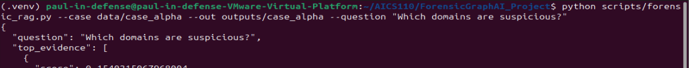

```bash
cp outputs/case_alpha/rag_answer.json outputs/case_alpha/rag_answer_q3_domains.json
```
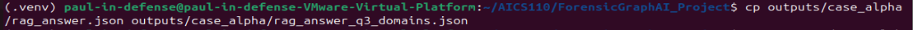

```bash
cat outputs/case_alpha/rag_answer_q3_domains.json
```
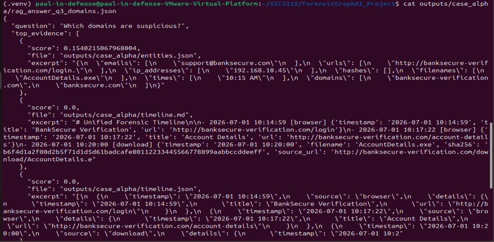
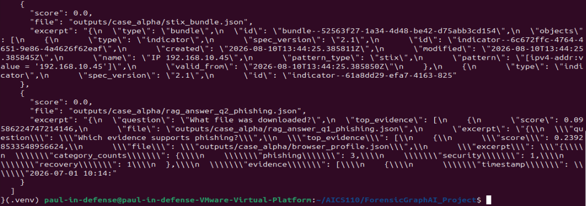


**Forensic Retrieval Q&A Results — Summary**

|Question                         |Top result                                 |Correct?                                                                    |
|---------------------------------|-------------------------------------------|----------------------------------------------------------------------------|
|Which evidence supports phishing?|`browser_profile.json` (score 0.239)       |**Correct** and well-ranked                                                 |
|What file was downloaded?        |`rag_answer_q1_phishing.json` (score 0.096)|**Incorrect** — a prior AI answer file outranked the actual primary evidence|
|Which domains are suspicious?    |`entities.json` (score 0.154)              |**Correct** and well-ranked                                                 |

**One correct retrieval:** for Question 3, `entities.json` correctly and directly surfaced both suspicious domains (`banksecure-verification.com`, `banksecure.com`), ranked appropriately above lower-relevance results.

**One significant limitation — self-referential contamination:** the retrieval assistant indexes files inside `outputs/case_alpha/` as searchable case evidence, which means its own prior answer files (`rag_answer.json` and any saved copies, such as `rag_answer_q1_phishing.json`) get treated as case evidence in later queries. This is most visible in Question 2, where the top two ranked results were both prior AI-generated answers, pushing the genuinely relevant `conversation.txt` and `timeline.json`/`.md` results down to third place or a 0.0 score. This is a compounding-hallucination risk: an examiner’s own saved outputs contaminate the evidence pool the tool searches over, and the problem worsens the more the tool is used and its outputs are saved inside the indexed folder.

**Practical mitigation identified during this lab:** save RAG answer copies *outside* the `outputs/case_alpha/` folder (e.g., in a separate `rag_saves/` directory) so they are not re-indexed as evidence in subsequent queries. This was not done for Questions 1–3 above (all copies were saved inside `outputs/case_alpha/`, which is why the contamination is visible in Q2 and Q3) but is documented here as a required correction for future runs of this lab.

-----

## 9. Lab 8 — Final Report Generation

**Goal:** generate the pipeline’s automated draft report, then layer manual examiner validation, screenshots, and analysis on top of it — the auto-generated file is a skeleton, not a finished deliverable.

**Commands run:**

```bash
python scripts/generate_report.py --case data/case_alpha --out outputs/case_alpha
```
`generate_report.py` assembles the outputs from every prior lab (entities, timeline, browser profile, generated files list) into a single draft Markdown report, `final_forensic_report.md`. This script prints `Report generated` on success.

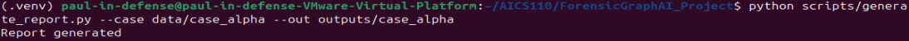

```bash
cat outputs/case_alpha/final_forensic_report.md
```
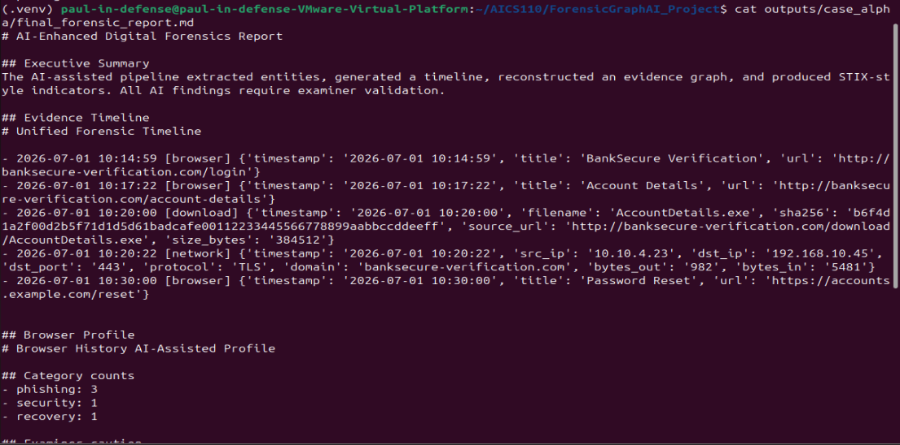
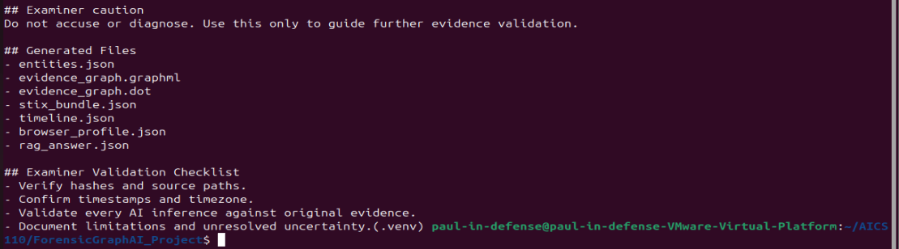


**Assessment of the auto-generated draft:** the report’s own Executive Summary correctly states that “all AI findings require examiner validation” and its Examiner Validation Checklist matches, almost exactly, the manual work already performed across Labs 1–7 in this document (hash verification, timestamp confirmation, AI-inference validation, limitations documentation). This confirms the auto-draft is intentionally designed as a skeleton requiring the examiner’s own analysis layered on top — which is exactly what Sections 10–14 below provide.

-----

## 10. Validation and Corroboration

- **Entity extraction (Lab 2)** was manually verified line-by-line against `conversation.txt`. All fields were confirmed as exact matches to the source text except one domain (`banksecure.com`), flagged Needs Review as it was derived from an email address rather than independently stated.
- **The IP address `192.168.10.45`** is independently confirmed across three separate evidence artifacts: entity extraction from the conversation text (Lab 2), the knowledge graph (Lab 3), and the network log via timeline fusion (Lab 6). Three separately generated outputs, drawing from different underlying evidence, all agree — this is genuine cross-source corroboration, not just repetition of the same AI output.
- **The SHA256 hash for `AccountDetails.exe`** recorded in the knowledge graph (Lab 3) matches exactly the hash recorded in the timeline’s download event (Lab 6) — confirming no drift between two independently generated AI outputs.
- **The browser profile’s three visit timestamps (Lab 5)** match exactly the three browser-type events in the fused timeline (Lab 6) — consistent across both outputs.
- **The knowledge graph surfaced a browser visit (the 10:30:00 password-reset page)** that was absent from the Lab 2 flat entity extraction — a genuine gap caught only by cross-checking two different AI outputs against each other, not by trusting either one alone.

## 11. Limitations and Uncertainty

- The STIX bundle (Lab 4) omits a hash indicator despite the hash being available elsewhere in the same pipeline’s output — an incomplete indicator set.
- The extracted phishing URL carries a trailing-period punctuation artifact (Lab 2), which persists uncorrected into the STIX bundle (Lab 4) and could break exact-match tooling downstream.
- The `banksecure.com` domain entity (Lab 2) is derived from the sender’s email address rather than independently confirmed in the source text — treated throughout this report as Needs Review, not established fact.
- The retrieval assistant (Lab 7) is vulnerable to self-referential contamination: its own prior output files get indexed and cited as case evidence in later queries, most severely affecting the “What file was downloaded?” question, where it displaced genuinely relevant primary evidence.
- The password-reset visit at 10:30:00 (Labs 3, 5, 6) has not been independently confirmed to have succeeded — no account audit log was available in this evidence set.
- This entire case is synthetic training data. Findings, workflow, and tooling behavior documented here are not validated against real forensic ground truth, real adversarial evidence tampering, or any legal/courtroom evidentiary standard.
- A `DeprecationWarning` in `build_stix_bundle.py` (Lab 4) regarding `datetime.datetime.utcnow()` indicates a maintenance item in the underlying script, though it does not affect output correctness in this run.

## 12. Recommendations

1. **Fix the STIX bundle’s coverage gap** — extend `build_stix_bundle.py` to also emit a `file:hashes.'SHA-256'` indicator for any file hash present in the evidence, so the bundle isn’t missing an indicator type that’s already available elsewhere in the pipeline.
1. **Sanitize extracted URLs** — strip trailing sentence-punctuation from `extract_entities.py`’s URL/domain capture before it propagates into downstream artifacts like the STIX bundle.
1. **Isolate RAG-generated files from the RAG index** — either exclude `rag_answer*.json` files from `forensic_rag.py`’s search scope by default, or require saved answer copies to live outside `outputs/case_alpha/`. This is the single highest-impact fix identified in this project, since it directly caused the worst-performing query (Lab 7, Question 2).
1. **Add a “domain provenance” field** to entity extraction output — distinguishing domains directly stated in text from domains derived from other entities (like an email address), so the Needs Review distinction found manually in this report could be flagged automatically.
1. **Cross-reference entity extraction against all evidence sources**, not just `conversation.txt` — Lab 3’s graph builder already pulls from `browser_history.csv`, and doing the same in `extract_entities.py` would have caught the password-reset visit without requiring a separate manual cross-check.
1. **Update `datetime.utcnow()` usage** in `build_stix_bundle.py` to timezone-aware datetime objects, per the Python deprecation warning, before it is removed in a future Python version.

## 13. Conclusion

The evidence across all four source files, and the outputs derived from them across all eight labs, consistently supports a single incident narrative: the user received a phishing email from a spoofed banking domain (`banksecure-verification.com`, impersonating `banksecure.com`), visited two pages on that domain, downloaded an executable (`AccountDetails.exe`) from it, and the device made an outbound TLS connection to that same infrastructure within 22 seconds of the download completing — followed ten minutes later by an apparent remediation step (a password reset on a separate, legitimate-looking domain).

The IP address `192.168.10.45` is the strongest corroborated indicator in this case, appearing independently and consistently across three separate evidence sources. AI-assisted tooling meaningfully accelerated extraction, correlation, and report drafting throughout this project, but required manual correction or flagging in multiple places: an unindexed file hash in the STIX bundle, a malformed URL pattern carrying stray punctuation, an incomplete category count that needed row-level verification, and — most significantly — a retrieval assistant that cited its own prior answers as if they were independent case evidence. This last finding is the clearest demonstration in this project of the course’s central lesson: AI output is a lead requiring validation, never a finding to be trusted outright.

## 14. Findings Table

|Finding ID|Finding                                                                          |Evidence Source                        |AI/Manual                              |Confidence|Validation Status                                                          |
|----------|---------------------------------------------------------------------------------|---------------------------------------|---------------------------------------|----------|---------------------------------------------------------------------------|
|F-001     |Phishing email from spoofed sender support@banksecure.com                        |conversation.txt                       |AI-assisted + manual                   |High      |Validated                                                                  |
|F-002     |Malicious landing URL banksecure-verification.com/login                          |conversation.txt, entities.json        |AI-assisted + manual                   |High      |Validated (URL pattern has trailing-punctuation artifact — see Limitations)|
|F-003     |Suspicious executable AccountDetails.exe downloaded                              |conversation.txt, timeline.json        |AI-assisted + manual                   |High      |Validated                                                                  |
|F-004     |Outbound TLS connection to 192.168.10.45 corroborates phishing domain            |network_logs.csv, timeline.json        |AI-assisted + manual                   |High      |Validated — independent 3-source corroboration                             |
|F-005     |Password-reset visit on accounts.example.com following incident                  |browser_history.csv, evidence_graph.dot|AI-assisted + manual                   |Medium    |Needs further corroboration — no audit log available                       |
|F-006     |STIX bundle missing a hash indicator despite hash being available in the pipeline|stix_bundle.json vs. evidence_graph.dot|Manual (identified during Lab 4 review)|High      |Validated as a tool coverage gap                                           |
|F-007     |RAG retrieval assistant cites its own prior output as case evidence              |rag_answer_q1/q2/q3.json               |Manual (identified during Lab 7 review)|High      |Validated as a tool limitation                                             |
