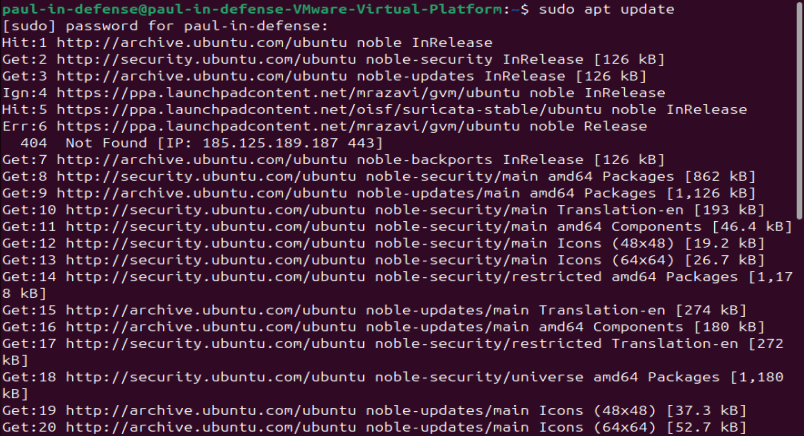
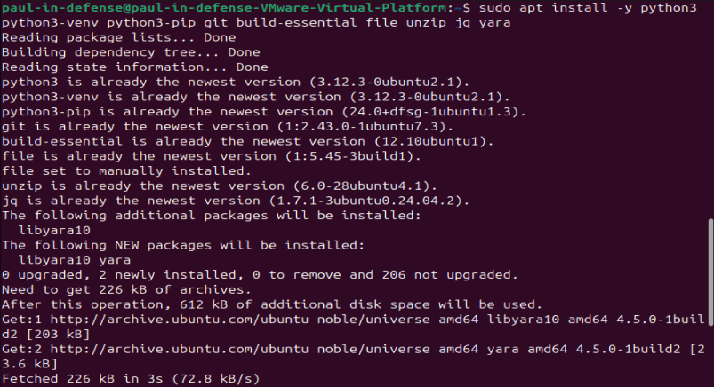

# MalwareLens AI Workbench — Full Report

**Course:** AICS-108 — Intelligent Malware Analysis (ICDFA Fellowship)
**Project:** MalwareLens AI Workbench
**Safety scope:** All work performed on safe, synthetic file metadata. No live or real malware was downloaded, executed, or analyzed at any point.

-----

## Table of Contents

- [Executive Summary](#executive-summary)
- [Methodology](#methodology)
  - [Environment Setup](#environment-setup)
  - [Lab 1 — Build the Linux AI Malware-Analysis Workstation](#lab-1--build-the-linux-ai-malware-analysis-workstation)
  - [Lab 2 — Generate a Safe Malware-Analysis Corpus](#lab-2--generate-a-safe-malware-analysis-corpus)
  - [Lab 3 — Engineer Static Features](#lab-3--engineer-static-features)
  - [Lab 4 — Train a Baseline Model](#lab-4--train-a-baseline-model)
  - [Lab 5 — Train a Deep Malware Classifier](#lab-5--train-a-deep-malware-classifier)
  - [Lab 6 — Explain the Model and Reduce False Positives](#lab-6--explain-the-model-and-reduce-false-positives)
  - [Lab 7 — Cluster Samples into Families/Campaigns](#lab-7--cluster-samples-into-familiescampaigns)
  - [Lab 8 — AI-Assisted Capability Mapping](#lab-8--ai-assisted-capability-mapping)
  - [Lab 9 — Generate and Review Detection Rules](#lab-9--generate-and-review-detection-rules)
  - [Lab 10 — Build the Final Analyst Report](#lab-10--build-the-final-analyst-report)
- [Dataset and Feature Engineering](#dataset-and-feature-engineering)
- [Model Architecture](#model-architecture)
- [Evaluation Results](#evaluation-results)
- [Capability and Behavior Mapping](#capability-and-behavior-mapping)
- [Family Clustering and Intelligence Assessment](#family-clustering-and-intelligence-assessment)
- [Detection Engineering Output](#detection-engineering-output)
- [Recommendations](#recommendations)
- [Limitations and Production Controls](#limitations-and-production-controls)

-----

## Executive Summary

This project developed **MalwareLens AI Workbench**, a defensive, static-first AI malware triage system built entirely on safe, synthetic file metadata. The system ingests file-level static features, classifies files as benign or malicious using two independently trained models, explains its own decisions, clusters samples into likely families, maps evidence to MBC/MITRE ATT&CK behavior categories, and produces a human-reviewed YARA detection rule alongside an analyst-readable report.

Both models trained in this project — a Random Forest baseline and a deep MLP neural network — achieved perfect scores (precision, recall, F1, and ROC-AUC all 1.0) on a held-out 375-sample test set drawn from a 2,400-sample synthetic corpus. Rather than treating this as an unqualified success, this result is documented and interpreted as a limitation: it indicates the synthetic dataset’s classes are highly, likely too easily, separable — not that either model is production-ready against real-world malware.

Clustering analysis grouped the corpus into five family-aligned clusters, four of them near-pure by family, with one cluster showing meaningful overlap between loader-like and dropper-like samples — a finding that shaped the campaign hypotheses documented later in this report. An AI-generated YARA rule for the ransomware-like family was manually reviewed and tightened after its original logic was found to risk false-positive overlap with an unrelated family (infostealer-like), directly demonstrating why AI-generated detection logic requires human validation before operational use.

This project demonstrates that a small, defensively-scoped AI pipeline can move from raw synthetic file evidence through to actionable, analyst-reviewed detection output — while surfacing the exact kind of evaluation caveats (perfect scores on easy data, loose AI-generated rules) that a real security operations workflow must account for.

-----


## Methodology

### Environment Setup

The VM was updated and the required system tools installed before any project work began:

```bash
sudo apt update
```


```bash
sudo apt install -y python3 python3-venv python3-pip git build-essential file unzip jq yara
```


The project pack was made available inside the VM’s shared folder, then unzipped and entered:

```bash
unzip AICS108_Intelligent_Malware_Analysis_Course_Pack.zip
cd AICS108_Intelligent_Malware_Analysis_Course_Pack/MalwareLensAI_Project
```

All lab work from this point took place inside `MalwareLensAI_Project/`.

-----

### Lab 1 — Build the Linux AI Malware-Analysis Workstation

**Objective:** Install the Python environment and analyst tools, and verify everything works before starting the pipeline.

```bash
cd MalwareLensAI_Project
python3 -m venv .venv
source .venv/bin/activate
pip install -r requirements.txt
python -c "import torch, sklearn, pandas; print('AI malware lab ready')"
```

`python3 -m venv .venv` creates an isolated Python environment so the project’s packages don’t conflict with anything else on the system. `pip install -r requirements.txt` installs every dependency the project needs. The final line verifies the three core libraries — `torch`, `sklearn`, and `pandas` — import correctly, confirming the environment is ready.

**Result:** Environment verified successfully — `AI malware lab ready` printed with no import errors.

-----

### Lab 2 — Generate a Safe Malware-Analysis Corpus

**Objective:** Generate the synthetic (non-live) dataset simulating benign and malware-like files.

```bash
source .venv/bin/activate
python -m malwarelens_ai.synthetic_corpus
head -5 data/malwarelens_synthetic_features.csv
ls data/safe_samples
```

This script invents numeric “fingerprints” for six file categories: benign admin tools, loaders, ransomware-like, infostealer-like, botnet-like, and dropper-like samples. No real files are touched — every value is synthetically generated.

To get the true class distribution across the full dataset (not just the first 5 rows), the `family` column was isolated and counted:

```bash
cut -d, -f23 data/malwarelens_synthetic_features.csv | sort | uniq -c
```

> **Note:** Column 23 is `family` — confirmed by counting the CSV header fields (`file_size_kb`=1 through `section_perm_score`=22, `family`=23, `label`=24). An initial attempt used column 24, which returned the `label` (benign/malicious) count instead of the family breakdown — corrected before recording final results below.

**Result — class distribution (2,400 total rows):**

|Family          |Count|
|----------------|-----|
|benign_admin    |796  |
|loader_like     |385  |
|infostealer_like|374  |
|ransomware_like |328  |
|botnet_like     |296  |
|dropper_like    |221  |

796 benign vs. 1,604 malicious — a roughly 2:1 imbalance across five malicious sub-families, with `benign_admin` as the single largest individual class.

-----

### Lab 3 — Engineer Static Features

**Objective:** Inspect and interpret the engineered static features.

```bash
python - <<'PY'
import pandas as pd
from malwarelens_ai.synthetic_corpus import FEATURES
x = pd.read_csv('data/malwarelens_synthetic_features.csv')
print(x[FEATURES + ['family','label']].describe().T.head(12))
print(x.groupby('family').size())
PY
```

**Result — descriptive statistics for key features:**

|Feature             |mean |std  |min  |25%  |50% |75% |max  |
|--------------------|-----|-----|-----|-----|----|----|-----|
|entropy             |5.77 |1.39 |2.45 |4.51 |5.89|6.86|10.39|
|suspicious_api_count|5.63 |3.59 |0    |2    |7   |8   |15   |
|network_api_count   |4.61 |2.72 |0    |0    |1   |2   |11   |
|packed_score        |0.325|0.223|0.089|0.510|—   |—   |0.857|

Full engineered feature set (26 columns): `file_size_kb`, `entropy`, `num_sections`, `num_imports`, `suspicious_api_count`, `crypto_api_count`, `network_api_count`, `registry_api_count`, `process_api_count`, `persistence_hint_count`, `packed_score`, `url_count`, `ip_count`, `base64_blob_count`, `powershell_hint_count`, `anti_analysis_hint_count`, `signed_binary`, `debug_symbols`, `version_info_present`, `string_entropy`, `rare_import_ratio`, `section_perm_score`, `family`, `label`, `risk_bucket`, `sample_strings`.

Full interpretation is covered in [Dataset and Feature Engineering](#dataset-and-feature-engineering) below.

-----

### Lab 4 — Train a Baseline Model

**Objective:** Train a Random Forest baseline and evaluate it with more than just accuracy.

```bash
python -m malwarelens_ai.train_models
cat reports/metrics.json | jq '.random_forest_auc, .deep_mlp_auc'
ls models reports
```

A Random Forest is many decision trees voting together — a fast, interpretable baseline. This step trains it and saves precision, recall, F1, ROC-AUC, and a confusion matrix so performance can be judged properly rather than by accuracy alone.

**Result:** `models/static_rf.joblib` and `reports/metrics.json` generated; both `random_forest_auc` and `deep_mlp_auc` returned `1.0`.

-----

### Lab 5 — Train a Deep Malware Classifier

**Objective:** Train a deep MLP model and compare it fairly against the Random Forest baseline.

```bash
python - <<'PY'
import json
m=json.load(open('reports/metrics.json'))
print('Deep MLP macro F1:', m['deep_mlp']['macro avg']['f1-score'])
print('RF macro F1:', m['random_forest']['macro avg']['f1-score'])
PY
```

An MLP (Multi-Layer Perceptron) is a basic neural network. It is compared against the Random Forest using the identical train/test split, so the comparison is fair.

**Result:** Deep MLP macro F1 = 1.0, RF macro F1 = 1.0 — both models tied at the ceiling on this test split (375 samples: 123 benign, 252 malicious). Confusion matrix confirmed 123 true negatives, 252 true positives, 0 false positives, 0 false negatives.

-----

### Lab 6 — Explain the Model and Reduce False Positives

**Objective:** Identify which features the model relies on most, to judge trustworthiness and false-positive risk.

```bash
python - <<'PY'
import joblib, pandas as pd
bundle=joblib.load('models/static_rf.joblib')
rf=bundle['model'].named_steps['rf']
features=bundle['features']
print(pd.Series(rf.feature_importances_, index=features).sort_values(ascending=False).head(10))
PY
```

Feature importance shows which numeric signals (e.g. entropy, API counts) the Random Forest actually leaned on to make its decisions — this is how the model is “explained.”

**Result — ranked feature importance:**

|Rank|Feature               |Importance|
|----|----------------------|----------|
|1   |suspicious_api_count  |0.186     |
|2   |packed_score          |0.183     |
|3   |string_entropy        |0.151     |
|4   |section_perm_score    |0.133     |
|5   |entropy               |0.114     |
|6   |rare_import_ratio     |0.059     |
|7   |url_count             |0.053     |
|8   |num_imports           |0.033     |
|9   |network_api_count     |0.026     |
|10  |persistence_hint_count|0.023     |

-----

### Lab 7 — Cluster Samples into Families/Campaigns

**Objective:** Use PCA and clustering to group similar synthetic samples and form family/campaign hypotheses.

```bash
python -m malwarelens_ai.cluster_campaigns
ls reports/campaign_clusters.png reports/cluster_summary.json
cat reports/cluster_summary.json | head -40
```

PCA compresses the many engineered features down to two dimensions for plotting; clustering then groups statistically similar points — analogous to grouping malware into families or campaigns based on shared static traits.

**Result — 5 clusters identified:**

|Cluster|Dominant family           |Composition                                       |
|-------|--------------------------|--------------------------------------------------|
|0      |botnet_like               |170 botnet_like, 3 loader_like, 1 infostealer_like|
|1      |benign_admin              |493 benign_admin (pure)                           |
|2      |ransomware_like           |191 ransomware_like (pure)                        |
|3      |infostealer_like          |258 infostealer_like, 2 loader_like               |
|4      |loader_like / dropper_like|230 loader_like, 152 dropper_like (mixed)         |

Full interpretation is covered in [Family Clustering and Intelligence Assessment](#family-clustering-and-intelligence-assessment) below.

-----

### Lab 8 — AI-Assisted Capability Mapping

**Objective:** Map model evidence into MBC and MITRE ATT&CK-style behavior categories.

```bash
python -m malwarelens_ai.analyze_sample data/safe_samples/infostealer_like.json
cat reports/analysis_report.md
```

MBC (Malware Behavior Catalog) and MITRE ATT&CK are standard vocabularies analysts use to describe malware behavior (e.g. “Persistence”, “Command and Control”). This step maps the model’s numeric evidence into that shared language.

**Result:** Sample classified as **malicious-like**, malicious probability **0.994**, priority **P1**. Full behavior mapping is covered in [Capability and Behavior Mapping](#capability-and-behavior-mapping) below.

-----

### Lab 9 — Generate and Review Detection Rules

**Objective:** Auto-generate a YARA-style rule from evidence, then manually tighten it to avoid overmatching.

```bash
python -m malwarelens_ai.generate_rules data/safe_samples/ransomware_like.json
cat rules/ai_assisted_triage.yar
yara rules/ai_assisted_triage.yar data/safe_samples/ransomware_like.json || true
```

YARA rules are pattern-matching rules analysts use to flag files. AI can draft one quickly from evidence, but the result is often too broad — matching more files than it should — so manual review is required before use.

> **Note:** The first scan attempt used a mistyped filename (`ransomeware_like.json`); correcting it to `ransomware_like.json` (matching the actual file generated in Lab 2) resolved the “could not open file” error and produced a successful match: `AICS108_AI_Assisted_ransomware_like_Triage data/safe_samples/ransomware_like.json`.

Full rule content, the review/tightening process, and rationale are covered in [Detection Engineering Output](#detection-engineering-output) below.

-----

### Lab 10 — Build the Final Analyst Report

**Objective:** Run the full pipeline end-to-end and confirm every deliverable artifact exists.

```bash
python scripts/run_full_demo.py
find reports rules models -maxdepth 1 -type f -print
```

This single script re-runs the entire pipeline (data generation → model training → sample analysis → clustering → rule generation) so the final submission reflects one clean, reproducible run.

**Result:** Pipeline completed all 5 stages (`[1/5]` through `[5/5]`) and confirmed `DONE. Review reports/, models/, and rules/.` Every expected artifact was present:

```
reports/metrics.json
reports/cluster_summary.json
reports/analysis_report.md
reports/campaign_clusters.png
reports/confusion_matrix.png
reports/cluster_assignments.csv
reports/analysis_report.json
rules/ai_assisted_triage.yar
models/static_rf.joblib
models/deep_mlp.joblib
```

-----

## Dataset and Feature Engineering

The dataset consists of **2,400 synthetic file-metadata records** generated by `malwarelens_ai.synthetic_corpus`, spanning one benign class and five malicious sub-families (see [Lab 2](#lab-2--generate-a-safe-malware-analysis-corpus) for the full class breakdown). No real files, hashes, or executables were used at any stage — every numeric feature is synthetically generated to statistically resemble the static properties of real malware without containing any actual payload.

**Key feature interpretation:**

- **entropy** — measures byte-level randomness in a file. Packed, compressed, or encrypted content pushes entropy higher. High entropy is a *hint* of obfuscation, not proof of malice — legitimate compressed installers can also score high.
- **packed_score** — a composite score combining entropy and structural signals to estimate the likelihood a file has been deliberately packed/obfuscated to evade static detection.
- **suspicious_api_count** — counts references to Windows APIs commonly abused for malicious behavior (e.g. process injection, memory allocation). Overlaps with legitimate system utilities that also call these APIs.
- **network_api_count** — counts APIs related to network communication, relevant to command-and-control or exfiltration behavior. Any networked application, benign or malicious, shows non-zero values here.

**Features most prone to false positives:** `suspicious_api_count`, `network_api_count`, `entropy`, and `packed_score`. Many legitimate applications — installers, updaters, DRM-protected software, admin tools — are compressed/packed (raising entropy and packed_score) and legitimately call networking or system APIs (raising the two count features). Without corroborating context, these features alone can misclassify benign software as malicious.

**Class balance note:** The dataset carries a ~2:1 malicious-to-benign imbalance across five malicious sub-families, which is why macro-averaged metrics (rather than raw accuracy) were used throughout evaluation.

-----

## Model Architecture

Two models were trained on the identical feature set and train/test split, to enable a fair comparison:

- **Random Forest baseline** (`models/static_rf.joblib`) — an ensemble of decision trees voting together. Chosen as a fast, interpretable baseline well-suited to a small, tabular, engineered-feature dataset.
- **Deep MLP** (`models/deep_mlp.joblib`) — a basic feed-forward neural network (Multi-Layer Perceptron), trained on the same static features to test whether a deep-learning approach offers any advantage over the classical baseline.

Both models were trained via `malwarelens_ai.train_models` on **CPU only** — no GPU was required given the dataset’s tabular, moderate-sized nature. The test split held out 375 samples (123 benign, 252 malicious) for evaluation.

-----

## Evaluation Results

Both models achieved **identical, perfect scores** on the held-out test set:

|Metric    |Random Forest|Deep MLP|
|----------|-------------|--------|
|Precision |1.0          |1.0     |
|Recall    |1.0          |1.0     |
|F1 (macro)|1.0          |1.0     |
|ROC-AUC   |1.0          |1.0     |

**Confusion matrix (Deep MLP):**

|                    |Predicted benign|Predicted malicious|
|--------------------|----------------|-------------------|
|**Actual benign**   |123 (TN)        |0 (FP)             |
|**Actual malicious**|0 (FN)          |252 (TP)           |

**Interpretation:** Neither model can be meaningfully called “better” from this run — both hit the ceiling. This result is treated as an important caveat rather than a success: a perfect score on synthetic evaluation data indicates the classes are highly, likely too easily, separable by the engineered features — not that either model is ready for production against real-world malware. This is precisely why accuracy alone is an insufficient metric: precision and recall show *how* a model errs (false positives waste analyst time; false negatives let malware through undetected), F1 balances both, and ROC-AUC evaluates performance across all thresholds rather than a single cutoff. A model that scores perfectly on easy synthetic data provides no evidence it will perform this well on messier, real-world samples.

Two theoretical causes of false positives/negatives, not observed in this run but relevant for production deployment:

1. **False positive risk:** a legitimate but packed/compressed installer could trigger elevated entropy and packed_score, since these features are shared by benign and malicious packed software alike.
1. **False negative risk:** a malicious sample deliberately engineered to minimize suspicious signals (low API counts, low entropy, no persistence hints) — an evasive sample — was not represented in this synthetic corpus and would likely evade detection.

-----

## Capability and Behavior Mapping

Sample analyzed: `data/safe_samples/infostealer_like.json`, via `malwarelens_ai.analyze_sample`.

**Classification result:** malicious-like | malicious probability: **0.994** | priority: **P1**

|Signal                                                           |Value|MBC                                               |ATT&CK                                                   |
|-----------------------------------------------------------------|-----|--------------------------------------------------|---------------------------------------------------------|
|crypto_api_count                                                 |4    |Cryptography                                      |Impact / Data Encrypted for Impact                       |
|network_api_count                                                |8    |Command and Control                               |Command and Control                                      |
|registry_api_count                                               |8    |Persistence / Registry                            |Modify Registry                                          |
|persistence_hint_count                                           |2    |Persistence                                       |Boot or Logon Autostart Execution                        |
|Strings: `Login Data`, `Cookies`, `wallet.dat`, `browser_history`|—    |Credential Access *(analyst-added interpretation)*|Credentials from Password Stores / Data from Local System|

The last row was added by analyst review — the automated tool mapped the four numeric signals but did not explicitly tag the string evidence, which is exactly the kind of gap a human analyst is expected to catch.

**What still needs manual confirmation** (per the tool’s own output): confirm findings with static triage tools such as capa/YARA in an isolated lab; review false-positive risk before any containment recommendation; formally map confirmed capabilities to MBC/MITRE ATT&CK; and do not execute live malware unless instructor-approved isolation is in place.

-----

## Family Clustering and Intelligence Assessment

PCA reduced the engineered feature space to two components, and clustering identified **5 distinct groups** across the 2,400-sample corpus:

|Cluster|Dominant family           |Composition                                                   |
|-------|--------------------------|--------------------------------------------------------------|
|0      |botnet_like               |170 botnet_like, 3 loader_like, 1 infostealer_like (174 total)|
|1      |benign_admin              |493 benign_admin (pure)                                       |
|2      |ransomware_like           |191 ransomware_like (pure)                                    |
|3      |infostealer_like          |258 infostealer_like, 2 loader_like (260 total)               |
|4      |loader_like / dropper_like|230 loader_like, 152 dropper_like (mixed, 382 total)          |

Four of five clusters are near-pure by family, showing the engineered features capture meaningful behavioral differences between categories. One cluster (Cluster 4) mixes loader_like and dropper_like almost evenly — suggesting these two families share overlapping static characteristics, consistent with both typically staging and executing a second payload.

**Intelligence hypotheses:**

1. **Botnet campaign cluster (Cluster 0):** 170 of 174 members are botnet_like — a tight behavioral signature likely driven by consistently high `network_api_count` and persistence indicators typical of C2-connected malware.
1. **Loader/Dropper convergence (Cluster 4):** The near-even mix of loader_like (230) and dropper_like (152) suggests these families may represent the same underlying campaign infrastructure at different stages — a dropper that installs a loader, or a loader reused across multiple dropper campaigns.
1. **Ransomware isolation (Cluster 2):** ransomware_like forms its own clean, separate cluster (191/191), likely driven by distinctive features like crypto_api_count — consistent with ransomware’s unique encryption-focused behavior profile.

-----

## Detection Engineering Output

**AI-generated rule (original)** — produced by `malwarelens_ai.generate_rules` on `ransomware_like.json`:

```yara
rule AICS108_AI_Assisted_ransomware_like_Triage
{
    meta:
        course = "AICS-108 Intelligent Malware Analysis"
        purpose = "Training triage rule generated from synthetic/static indicators"
        safety = "Review before operational use; do not treat as production quality"
    strings:
        $s1 = "AES_set_encrypt_key" ascii nocase
        $s2 = "shadowcopy" ascii nocase
        $s3 = "recover-files.txt" ascii nocase
        $s4 = "wallet placeholder" ascii nocase
        $s5 = "encrypted_marker" ascii nocase
    condition:
        2 of ($s*)
}
```

**Problem identified:** The condition `2 of ($s*)` is too loose. `$s4` (“wallet placeholder”) also appears in infostealer-family samples (see [Capability and Behavior Mapping](#capability-and-behavior-mapping) above), meaning the original rule risked matching the wrong malware family, or a benign file that happens to reference wallets.

**Reviewed/tightened rule (final):**

```yara
rule AICS108_AI_Assisted_ransomware_like_Triage_v2
{
    meta:
        course = "AICS-108 Intelligent Malware Analysis"
        purpose = "Training triage rule generated from synthetic/static indicators"
        safety = "Reviewed and tightened by analyst; still requires human validation before operational use"
    strings:
        $s1 = "AES_set_encrypt_key" ascii nocase
        $s2 = "shadowcopy" ascii nocase
        $s3 = "recover-files.txt" ascii nocase
        $s4 = "wallet placeholder" ascii nocase
        $s5 = "encrypted_marker" ascii nocase
    condition:
        ( $s1 and $s2 ) or ( $s1 and $s3 ) or ( $s1 and $s5 )
}
```

The tightened condition requires the core encryption indicator (`$s1`, AES_set_encrypt_key) to co-occur with a second, genuinely ransomware-specific signal (shadow-copy deletion, ransom-note filename, or an encryption marker) — removing the weak wallet-string path to a match.

**Validation:** `yara rules/ai_assisted_triage.yar data/safe_samples/ransomware_like.json` correctly matched the rule against its source sample.

**Why AI-generated rules require human review:** AI can quickly surface candidate strings from evidence, but it doesn’t understand operational context — which strings are genuinely discriminating versus coincidentally shared across malware families. The original rule’s loose “any 2 of 5” condition is a concrete example: it would have matched on combinations that don’t actually indicate ransomware behavior. Human review is required to validate that rule logic reflects real behavioral specificity, not just statistical co-occurrence, before a rule is trusted operationally.

-----

## Recommendations

1. **Do not deploy either model as-is.** The perfect evaluation scores are a product of a highly separable synthetic dataset, not evidence of real-world readiness. Before any operational use, both models should be retrained and re-evaluated against a harder or more realistic dataset — the course’s own Advanced Extension track (EMBER/EMBER2024 public feature datasets) is the natural next step.
1. **Treat AI-generated YARA rules as a first draft only.** The Lab 9 tightening exercise is a direct, reproducible example of why: an unreviewed rule risked cross-family false positives. Every AI-generated rule should go through the same manual review-and-tighten process before use.
1. **Corroborate high-signal-but-noisy features before acting on them.** `entropy`, `packed_score`, and `string_entropy` — three of the five most important features to the model — are also commonly triggered by legitimate packed/compressed software. Analysts should require at least one behavior-specific signal (e.g. `persistence_hint_count`, `crypto_api_count`) alongside these before escalating a P1 classification.
1. **Investigate the Cluster 4 loader/dropper overlap further.** The mixed cluster is a genuine intelligence finding worth follow-up — either the feature set needs refinement to distinguish these families, or the overlap reflects a real-world pattern (shared campaign infrastructure) worth documenting for threat intel purposes.
1. **Introduce evasive and drift test cases before any production conversation.** The current synthetic corpus contains no adversarially-evasive samples and no time-shifted “drift” data slice — both are required by the course’s evaluation standard and would meaningfully stress-test whether the perfect scores hold up.

-----

## Limitations and Production Controls

**Data bias:** The dataset carries a ~2:1 malicious:benign class imbalance, and the near-perfect separability observed in evaluation suggests the synthetic generator produces easier-to-classify samples than real-world malware would present. This should not be mistaken for production-grade performance.

**False positives:** Several of the model’s top features (`entropy`, `packed_score`, `network_api_count`, `suspicious_api_count`) are known to also occur in legitimate, packed, or networked software. Real-world deployment would require a higher evidentiary bar than these features alone provide — corroborating signals and analyst review remain essential.

**Drift:** Not tested in this project. The course standard calls for evaluating a second dataset slice or a changed feature distribution to test for model drift over time; this is a documented next step, not an oversight.

**Adversarial ML:** Not exercised in this project. An evasive sample deliberately engineered to minimize suspicious signals was discussed as a theoretical false-negative risk but was not present in, or tested against, the synthetic corpus used here.

**Isolation and governance:** All work in this project was performed using synthetic data only — no live malware was downloaded or executed at any stage, consistent with the course’s strict safety doctrine. Both the AI-generated behavior mapping (Capability and Behavior Mapping) and the AI-generated YARA rule (Detection Engineering Output) required manual analyst review before being considered trustworthy, consistent with the course’s human-review requirement for any AI-generated labels, rules, or reports. No output from this project should be treated as production-ready or used for real detection/response decisions without further validation on real-world data and instructor/organizational sign-off.