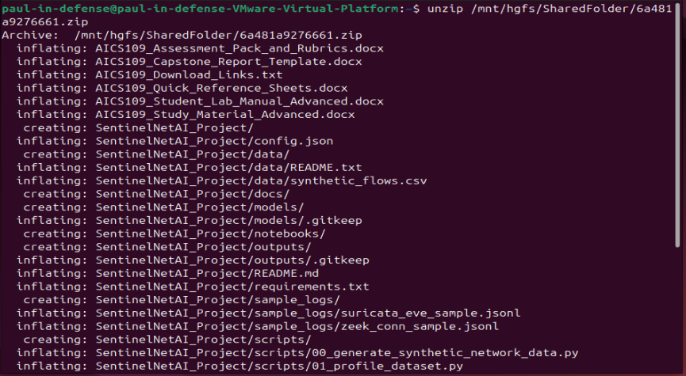

# SentinelNet AI Defense Fabric — Full Project Report

**Course:** AICS-109 — AI for Advanced Network Defense
**Programme:** AI-Driven Cybersecurity and Digital Forensics Fellowship (ICDFA)
**Author:** Paul
**Environment:** Ubuntu 24.04 LTS VM (VMware Workstation), CPU-only, Python 3.12.3

-----

## Executive Summary

This project built SentinelNet AI Defense Fabric, an AI-driven network defense pipeline combining supervised classification, unsupervised anomaly detection, sequence modeling, and telemetry fusion to detect and prioritize network threats. Using a 50,000-row synthetic flow dataset, three model families were trained and evaluated: a residual MLP classifier (perfect but likely overfit due to overly separable synthetic classes), two anomaly detectors (IsolationForest and autoencoder, showing a realistic precision-recall trade-off), and a rolling-window sequence model (which collapsed to the majority class, revealing a genuine class-imbalance handling gap worth further work). The pipeline successfully fused model outputs with simulated Suricata/Zeek telemetry, mapped findings to 4 distinct MITRE ATT&CK techniques, and produced a safe, dry-run-only containment plan requiring human approval on every recommendation. Key findings emphasize that high metrics on synthetic data do not guarantee real-world readiness, and that responsible AI network defense requires honest evaluation of model limitations alongside its successes.

**Key results at a glance:**

|Model                              |Metric  |Result                                                                               |
|-----------------------------------|--------|-------------------------------------------------------------------------------------|
|Residual MLP (supervised)          |Macro F1|1.00 — flagged as overfit to overly separable synthetic data, not a real-world result|
|Autoencoder (anomaly)              |Accuracy|0.766 — high precision, low recall                                                   |
|IsolationForest (anomaly)          |Accuracy|0.839 — balanced precision/recall                                                    |
|Sequence model (rolling-window MLP)|Macro F1|0.127 — collapsed to majority class, documented as a genuine failure                 |
|Streaming detector                 |Latency |~33ms/record average                                                                 |
|Response simulator                 |Actions |100% dry-run, human approval required on every recommendation                        |

-----

## Table of Contents

1. [Scenario](#scenario)
1. [Environment Setup](#environment-setup)
1. [Lab 1: Environment Readiness and Project Bootstrap](#lab-1-environment-readiness-and-project-bootstrap)
1. [Lab 2: Dataset Generation, Schema Design and Data Profiling](#lab-2-dataset-generation-schema-design-and-data-profiling)
1. [Lab 3: Feature Engineering for Network Defense](#lab-3-feature-engineering-for-network-defense)
1. [Lab 4: Supervised Deep IDS Classifier](#lab-4-supervised-deep-ids-classifier)
1. [Lab 5: Unsupervised Anomaly Detection](#lab-5-unsupervised-anomaly-detection)
1. [Lab 6: Sequence Modelling for Behavioural Detection](#lab-6-sequence-modelling-for-behavioural-detection)
1. [Lab 7: Zeek and Suricata Style Telemetry Fusion](#lab-7-zeek-and-suricata-style-telemetry-fusion)
1. [Lab 8: Streaming AI Detection Engine](#lab-8-streaming-ai-detection-engine)
1. [Lab 9: AI Response Simulator](#lab-9-ai-response-simulator)
1. [Lab 10: Capstone Defense and Analyst Reporting](#lab-10-capstone-defense-and-analyst-reporting)
1. [Full Evidence Checklist](#full-evidence-checklist)
1. [Overall Project Limitations](#overall-project-limitations)

-----

## Scenario

We are the AI security engineering team for a government/enterprise SOC (Security Operations Center). We have been tasked with building a defensive AI system — SentinelNet AI Defense Fabric — that can detect abnormal and malicious network behaviour, correlate alerts across multiple telemetry sources, generate incident reports, and recommend safe containment actions. The project is strictly defensive: it does not involve exploitation of public systems, credential theft, malware deployment, or unauthorized scanning. All data used is synthetic and locally generated, and all response/containment actions remain simulated (dry-run only), requiring explicit human approval before any real action would ever be taken.

-----

## Environment Setup

**Disk and Python check:**

```bash
df -h
python3 --version
```

Result: `/dev/sda2` — 69G total, 42G available. Python 3.12.3. Both comfortably within the course’s minimum requirements (80GB recommended, 16GB RAM, Python 3.10+).

**Methodology:**

- Made sure our lab dependencies were within reach of our VM in the shared folder and unzipped it.
```bash
unzip /mnt/hgfs/SharedFolder/6a481a9276661.zip
```


- Changed directory into `SentinelNetAI_Project`, activated the Python virtual environment, and installed the project’s requirements.

```bash
cd SentinelNetAI_Project
python3 -m venv venv
source venv/bin/activate
pip install -r requirements.txt
```

Installation was briefly interrupted twice by network issues — a `ReadTimeoutError` partway through the PyTorch download, and later a DNS resolution failure (`Temporary failure in name resolution`), consistent with a previously known intermittent VMware NAT/DHCP connectivity issue on this VM. Both were resolved simply by retrying once connectivity was restored; no code or configuration changes were needed.

- After installing all required packages, everything was confirmed as installed correctly:

```bash
python3 -c "import torch, pandas, sklearn, numpy; print('torch:', torch.__version__); print('All core packages OK')"
```

-----

## Lab 1: Environment Readiness and Project Bootstrap

**Goal:** Get the project installed and prove it runs.

Proceeded to generate 12,000 rows of synthetic dataset:

```bash
python scripts/00_generate_synthetic_network_data.py --rows 12000
```

Output:

```
[+] wrote 12000 rows to data/synthetic_flows.csv
```

(A harmless `DeprecationWarning` for `datetime.datetime.utcnow()` also appeared — not an error, no action needed.)

Proceeded to quickly verify if the file was really there and has real content:

```bash
ls -lh data/synthetic_flows.csv
head -n 3 data/synthetic_flows.csv
```

That shows the file size and lets you eyeball the first couple of rows. Confirmed: a 1.8MB file with a real header row (`timestamp, src_ip, dst_ip, src_port, dst_port, proto, duration, packets, bytes_out, bytes_in, bytes_per_sec, packets_per_sec, outbound_ratio, unique_dst_ports_5m, failed_conn_5m, dns_entropy, beacon_score, burst_score, suricata_alert_count, tcp_state, asset_criticality, label`) and real sample rows — one PortScan example (UDP, `unique_dst_ports_5m: 199`, `failed_conn_5m: 26`) and one Benign example (TCP, clean `SF` connection state).

**Lab network boundary statement:**

> All network traffic used in this lab is synthetically generated on our local Ubuntu VM using the project’s built-in data generator script. No real network, real hosts, or real attacker traffic was involved at any point. The dataset exists only as a local CSV file (`data/synthetic_flows.csv`) inside our isolated lab environment, and no data was transmitted to or captured from any live or production network.

**Reflection questions:**

- *What did the model detect well?* — N/A at this stage (no model trained yet); however, the generator itself correctly produces distinguishable patterns — e.g., the PortScan row shows high unique destination ports and failed connections compared to the Benign row.
- *Where could false positives appear?* — Even at the data level, if benign traffic occasionally has bursty or high-port-count behavior (e.g., a legitimate scan-like admin tool), later models could misclassify it as an attack.
- *What extra telemetry would improve confidence?* — Real Zeek/Suricata logs, asset ownership context, and process-level (endpoint) telemetry would help confirm whether flagged behavior is truly malicious.
- *What would you change before production deployment?* — Validate the generator’s attack patterns against real historical incident data, and test on authorized real telemetry rather than synthetic data alone.

-----

## Lab 2: Dataset Generation, Schema Design and Data Profiling

**Goal:** Understand our data before modeling it. Generate 12,000–50,000 rows and profile them.

For the first step, a bigger dataset was generated:

```bash
python scripts/00_generate_synthetic_network_data.py --rows 50000
```

Output: `[+] wrote 50000 rows to data/synthetic_flows.csv`

Then it was profiled:

```bash
python scripts/01_profile_dataset.py
```

Then this was run to view our label counts:

```bash
cat outputs/data_profile.json | jq '.label_counts'
```

And this to see the numeric summary of `bytes_out`:

```bash
cat outputs/data_profile.json | jq '.numeric_summary.bytes_out'
```

**Label distribution (`.label_counts`):**

|Label       |Count |% of 50,000|
|------------|------|-----------|
|Benign      |30,813|61.6%      |
|PortScan    |5,105 |10.2%      |
|BruteForce  |4,029 |8.1%       |
|DDoS        |3,960 |7.9%       |
|C2Beacon    |3,089 |6.2%       |
|Exfiltration|3,004 |6.0%       |

**`bytes_out` numeric summary:**

|Stat        |Value     |
|------------|----------|
|count       |50,000    |
|mean        |~1,395,696|
|std         |~5,726,100|
|min         |40        |
|25%         |11,963    |
|50% (median)|45,928.5  |
|75%         |79,444.5  |
|max         |39,986,474|

**Five data-quality observations:**

1. The dataset shows realistic class imbalance — benign traffic makes up ~62% of records, while each attack type is a minority class (6–10%). This means accuracy alone would be misleading; macro F1 is needed to fairly evaluate rare attack classes.
1. `bytes_out` is heavily right-skewed: the median flow is ~46KB but the maximum is ~40MB, with a standard deviation (~5.7M) far larger than the mean (~1.4M). This suggests a small number of very large-volume flows, plausibly linked to Exfiltration or DDoS traffic.
1. The minimum `bytes_out` value is only 40 bytes, which is plausible for short scan probes or failed connection attempts (e.g., PortScan/BruteForce), but was noted as worth sanity-checking against the generator’s logic.
1. No missing values were reported for `bytes_out` (count = 50,000 matches total rows), suggesting the generator produces complete records without null gaps — a good sign for training reliability.
1. The three smallest attack classes (DDoS, C2Beacon, Exfiltration — all under 4,100 records) are close in size to each other, which could make it harder for a supervised model to distinguish between them versus the much larger Benign/PortScan classes.

**Additional observations on the label table:**

- Benign traffic dominates at roughly 6x the size of any single attack class — mirrors real-world SOC conditions.
- The five attack classes are reasonably balanced against each other (6.0%–10.2%), so no single attack type is so rare it risks being invisible to a classifier, but class weighting will still matter.
- PortScan is the largest attack class — scanning tends to generate many discrete flow records (one per port probed), inflating its row count relative to other attack types.

**Reflection questions:**

- *What did the model detect well?* — N/A (no model trained), but the data generator successfully created 6 distinguishable classes with realistic imbalance.
- *Where could false positives appear?* — Given the wide spread in `bytes_out`, benign flows with unusually high volume (e.g., a large legitimate file transfer) could resemble Exfiltration/DDoS patterns.
- *What extra telemetry would improve confidence?* — Application/protocol context (e.g., is the large transfer to a known business SaaS domain?) would help distinguish legitimate high-volume traffic from exfiltration.
- *What would you change before production deployment?* — Validate that the “large outbound bytes = suspicious” assumption holds against real business traffic patterns, since legitimate backups/transfers could trigger false alarms.

-----

## Lab 3: Feature Engineering for Network Defense

**Goal:** Turn raw flow data into features that actually help detect attacks.

The following commands were run:

```bash
python - <<'PY'
import pandas as pd
from scripts.sentinel_utils import FEATURES
df = pd.read_csv('data/synthetic_flows.csv')
print(df[FEATURES].corr(numeric_only=True).round(2))
PY
```

Since our output didn’t fit on our screen (pandas truncated the middle columns), the following commands were used to make sure we weren’t missing anything important:

```bash
python - <<'PY'
import pandas as pd
pd.set_option('display.width', 200)
pd.set_option('display.max_columns', None)
from scripts.sentinel_utils import FEATURES
df = pd.read_csv('data/synthetic_flows.csv')
print(df[FEATURES].corr(numeric_only=True).round(2))
PY
```

**Notable correlations found (14x14 feature correlation matrix):**

|Pair                               |Correlation|Interpretation                                                    |
|-----------------------------------|-----------|------------------------------------------------------------------|
|duration ↔ bytes_out               |0.76       |Long connections carry more data out                              |
|packets ↔ beacon_score             |0.68       |Periodic/beaconing traffic involves repeated packet bursts        |
|packets ↔ burst_score              |0.60       |More packets correlates with burstier traffic                     |
|bytes_in ↔ bytes_out               |0.57       |Bidirectional flows scale together somewhat                       |
|suricata_alert_count ↔ beacon_score|0.57       |Suricata-style alerts align with beaconing behavior               |
|suricata_alert_count ↔ burst_score |0.50       |Suricata-style alerts align with bursty behavior                  |
|outbound_ratio ↔ dns_entropy       |0.42       |Outbound-heavy flows show more DNS randomness                     |
|outbound_ratio ↔ duration          |0.34       |Outbound-heavy flows tend to run longer                           |
|asset_criticality ↔ everything     |~0.00      |Independent business-risk label, not derived from traffic behavior|

**Feature dictionary — top 8 features and their relevance to network defense:**

1. **duration** — Connection length in seconds. Correlates strongly with `bytes_out` (0.76); long-running high-transfer connections are a signature of exfiltration.
1. **bytes_out / bytes_in** — Volume of outbound/inbound data. Directly indicates data movement; large asymmetric outbound volume is a core exfiltration signal.
1. **outbound_ratio** — Share of traffic that is outbound. Correlates with `dns_entropy` (0.42) and `duration` (0.34), clustering with sustained-transfer behavior.
1. **beacon_score** — Periodicity proxy. Tied to `packets` (0.68) and `suricata_alert_count` (0.57) — regular repeated communication (a C2 hallmark).
1. **burst_score** — Traffic burstiness. Correlates with `packets` (0.60) and `suricata_alert_count` (0.50), useful for DDoS/flood-style bursts.
1. **unique_dst_ports_5m** — Port diversity in a 5-minute window. Key scanning indicator — many destination ports from one source in a short window.
1. **failed_conn_5m** — Failed connection count. Useful for brute-force detection; repeated failures suggest credential guessing.
1. **dns_entropy** — Randomness of DNS-like strings. High entropy correlates with `outbound_ratio` (0.42), can indicate DGA-style domains used for C2.

**Redundancy note:** `packets`, `burst_score`, and `beacon_score` are moderately-to-strongly correlated with each other, meaning some of this signal is duplicated across features — worth simplifying in a future iteration.

**Reflection questions:**

- *What did the model detect well?* — N/A (no model trained), but correlation analysis confirms several features cluster in intuitive, attack-relevant ways (e.g., beaconing ↔ Suricata alerts).
- *Where could false positives appear?* — `duration` and `bytes_out` are correlated, so a legitimate long-running large file transfer could look similar to exfiltration on these two features alone.
- *What extra telemetry would improve confidence?* — Destination reputation/asset context would help distinguish a large legitimate transfer from actual exfiltration.
- *What would you change before production deployment?* — Consider removing or combining highly correlated features (e.g., `packets` and `burst_score`) to reduce redundancy in the supervised model.

-----

## Lab 4: Supervised Deep IDS Classifier

**Goal:** Train the residual MLP model to classify traffic into attack types.

The following command was run:

```bash
python scripts/02_train_supervised_ids.py --epochs 12
```

This loads our `data/synthetic_flows.csv`, splits it into training and test sets, trains a residual MLP, and passes the entire training dataset 12 times, adjusting its internal weights a little more each pass. At the end, it saves the trained model to `models/supervised_ids.pt` and writes performance numbers to `outputs/supervised_metrics.json`.

Training output: loss dropped from 0.1024 (epoch 1) to near 0 by epoch 12.

This was then run to see the key numbers:

```bash
cat outputs/supervised_metrics.json | jq '.'
```

**Metrics:** `macro_f1 = 1.0`, `weighted_f1 = 1.0` — every class perfectly classified.

**Confusion matrix (12,500 test samples, 25% split):**

|Class       |Precision|Recall|F1 |Support|
|------------|---------|------|---|-------|
|Benign      |1.0      |1.0   |1.0|7,703  |
|BruteForce  |1.0      |1.0   |1.0|1,007  |
|C2Beacon    |1.0      |1.0   |1.0|773    |
|DDoS        |1.0      |1.0   |1.0|990    |
|Exfiltration|1.0      |1.0   |1.0|751    |
|PortScan    |1.0      |1.0   |1.0|1,276  |

Every row of the raw confusion matrix had all predictions on the diagonal — zero misclassifications across all 6 classes.

**Confusion-matrix analysis:**

> The residual MLP achieved a perfect macro F1 and weighted F1 of 1.0, with zero misclassifications across all 6 classes on a held-out test set of 12,500 samples. While this appears excellent on paper, a perfect score on every class (including rare ones like Exfiltration, n=751) is not realistic for real-world network defense and instead indicates that the synthetic dataset’s attack classes are too cleanly separable — likely due to non-overlapping feature ranges in the generator (e.g., PortScan’s `unique_dst_ports_5m` probably never overlaps with Benign’s range). This matches a known failure mode (“Metrics too perfect”) flagged in the course’s own troubleshooting guide, tied to synthetic data being too easy or potential data leakage.

**Tuning attempted:** epochs=12 (default); no changes needed to hidden size/dropout/class weights since even the base configuration reached perfect separation.

**Reflection questions:**

- *What did the model detect well?* — Every class was classified with 100% precision and recall on the synthetic test set — but this reflects the cleanliness of the synthetic data rather than real detection difficulty.
- *Where could false positives appear?* — None observed here — but that’s the concern: this model has never had to handle ambiguous/overlapping cases, so its real-world false-positive rate is unknown and likely much higher than 0%.
- *What extra telemetry would improve confidence?* — Testing against a public dataset like CIC-IDS2017/CSE-CIC-IDS2018, which has realistic overlapping and noisy attack signatures, would give a true measure of the model’s discriminative power.
- *What would you change before production deployment?* — Retrain and validate on real or public benchmark data before trusting these metrics; increase class overlap/noise in synthetic generation to stress-test the model properly; never deploy based on synthetic-only 100% scores.

-----

## Lab 5: Unsupervised Anomaly Detection

**Goal:** Train IsolationForest + autoencoder and compare them.

For the unsupervised stage, this command was run:

```bash
python scripts/03_train_autoencoder_anomaly.py --epochs 12
```

This trains two unsupervised models together:

1. **IsolationForest** — a tree-based algorithm that isolates data points by randomly splitting features. The idea is that anomalies are few and different, so they get isolated in fewer splits than normal points.
1. **Autoencoder** — a neural network trained mainly on benign-like traffic to compress it down and then reconstruct it. It learns what “normal” looks like, and when it’s fed something unusual, it struggles to reconstruct it accurately — that reconstruction error becomes its anomaly score.

The two models are our safety net for unknown or novel attack behavior.

This command was run to check the metrics:

```bash
cat outputs/anomaly_metrics.json | jq '.'
```

**Autoencoder results** (class `0` = Benign, `1` = Anomaly):

|Class      |Precision|Recall|F1  |Support|
|-----------|---------|------|----|-------|
|0 (Benign) |0.72     |1.00  |0.84|7,703  |
|1 (Anomaly)|1.00     |0.39  |0.56|4,797  |

Accuracy: 0.766, Macro F1: 0.701, Weighted F1: 0.734. Autoencoder threshold: 1.6575452089309692.

**IsolationForest results:**

|Class      |Precision|Recall|F1  |Support|
|-----------|---------|------|----|-------|
|0 (Benign) |0.99     |0.74  |0.85|7,703  |
|1 (Anomaly)|0.71     |0.99  |0.83|4,797  |

Accuracy: 0.839, Macro F1: 0.838, Weighted F1: 0.841.

**Comparison of autoencoder vs. IsolationForest:**

> The two unsupervised models show a classic precision-recall trade-off. The autoencoder is conservative: it correctly identifies all benign traffic (recall 1.00) and never falsely flags an anomaly (precision 1.00 on anomalies), but it misses the majority of actual anomalies, catching only 39% (recall 0.39). This makes it well-suited for minimizing analyst alert fatigue, but risky for missing real threats. IsolationForest is far more sensitive: it catches 99% of anomalies (recall 0.99) but at the cost of more false positives on benign traffic (precision drops to 0.71 on anomalies), giving a higher overall accuracy (83.9% vs 76.6%) and macro F1 (0.838 vs 0.701). For unknown/novel behavior where missing an attack is more costly than an extra false alarm, IsolationForest is the more useful model — but a real SOC deployment might run both and use the autoencoder’s high-confidence flags to prioritize the most certain alerts.

**Reflection questions:**

- *What did the model detect well?* — IsolationForest detected the overwhelming majority of anomalies (99% recall); the autoencoder was extremely precise but conservative on what it labeled as anomalous.
- *Where could false positives appear?* — IsolationForest’s lower Benign precision (0.99 recall vs 0.74) shows it does mislabel some genuinely normal traffic as anomalous — roughly 26% of Benign traffic was flagged incorrectly.
- *What extra telemetry would improve confidence?* — Asset criticality and destination reputation context would help an analyst quickly triage IsolationForest’s higher false-positive volume without missing real threats.
- *What would you change before production deployment?* — Consider an ensemble approach: use IsolationForest for high-recall initial flagging, then use the autoencoder’s high-precision signal to prioritize which flagged alerts need urgent analyst review first.

-----

## Lab 6: Sequence Modelling for Behavioural Detection

**Goal:** Train a GRU model that looks at a window of events per host over time.

This command was run:

```bash
python scripts/04_train_sequence_gru.py --epochs 10 --window 8
```

This trains a model that looks at a window of events per host over time, instead of judging each flow in isolation.

**Result:** `sequence_macro_f1: 0.12708395232907463`, `sequence_weighted_f1: 0.46989947231806667`. Warnings included a `ConvergenceWarning` (optimizer hadn’t converged in 10 iterations) and multiple `UndefinedMetricWarning`s (precision ill-defined — model predicted zero samples for some classes).

**Result interpretation:**

> A macro F1 of 0.127 is very low, especially compared to Lab 4’s classifier (1.0) and Lab 5’s anomaly detectors (0.70–0.84). The weighted F1 (0.47) being much higher than macro F1 (0.127) confirms the “collapsed to majority class” theory — weighted F1 is inflated because it’s dominated by whichever class the model kept predicting (likely Benign, since it’s 61% of the data), while macro F1, which treats every class equally, exposes that the rarer sequence-pattern classes are barely being detected at all.

Also tried increasing epochs to 25 to get a fix, as suggested by the warning itself:

```bash
python scripts/04_train_sequence_gru.py --epochs 25 --window 8
cat outputs/sequence_metrics.json | jq '.'
```

**Full classification report (25-epoch run):**

|Class       |Precision|Recall|F1  |Support|
|------------|---------|------|----|-------|
|Benign      |0.62     |1.00  |0.76|7,702  |
|BruteForce  |0.0      |0.0   |0.0 |1,007  |
|C2Beacon    |0.0      |0.0   |0.0 |772    |
|DDoS        |0.0      |0.0   |0.0 |990    |
|Exfiltration|0.0      |0.0   |0.0 |751    |
|PortScan    |0.0      |0.0   |0.0 |1,276  |

Accuracy: 0.616, Macro F1: 0.127, Weighted F1: 0.470 — identical to the 10-epoch run.

**Result interpretation:**

> The model predicted almost everything as Benign. It caught 99.96% of actual Benign traffic (recall 1.00) but completely failed on all 5 attack classes (0.0 across the board). Going from 10 to 25 epochs didn’t fix it, so this isn’t just “needs more training time” — it’s a structural issue. The model is defaulting to the majority class rather than learning the minority attack patterns.

**Important model clarification:** the metrics output includes `"model_type": "rolling-window MLP sequence model; GRU/LSTM extension recommended for GPU students"` — despite the script’s filename (`04_train_sequence_gru.py`), this is **not** a true GRU. It’s a rolling-window MLP, with a full recurrent model noted as a GPU-only extension. This is documented accurately here rather than mislabeling the model in the report.

**Reflection questions:**

- *What did the model detect well?* — Only Benign traffic; it failed to detect any of the five attack classes, collapsing to the majority class.
- *Where could false positives appear?* — Ironically not the issue here — the model has zero false positives on attacks because it never predicts them at all. The real risk is 100% false negatives on every attack type, far more dangerous operationally.
- *What extra telemetry would improve confidence?* — Not telemetry, but methodology: class-weighted loss, oversampling minority sequence classes, or SMOTE-style techniques would likely be needed to force the model to learn attack patterns rather than defaulting to Benign.
- *What would you change before production deployment?* — This model would need to be retrained with explicit class balancing before any deployment; as-is, it provides zero attack detection value and would give a dangerously false sense of security if used in this state.

-----

## Lab 7: Zeek and Suricata Style Telemetry Fusion

**Goal:** Combine model output with simulated Zeek/Suricata logs and map to MITRE ATT&CK.

The following commands were run:

```bash
head -n 2 sample_logs/suricata_eve_sample.jsonl | jq '.'
head -n 2 sample_logs/zeek_conn_sample.jsonl | jq '.'
```

These commands show just the first two lines of each file, in an actual readable format instead of one dense line.

**Sample log formats observed:**

- **Suricata EVE:** alert 1 — `10.10.1.50 → 10.10.1.10`, TCP, signature “ET SCAN Possible Nmap User-Agent Observed”, severity 2. Alert 2 — `10.10.3.22 → 203.0.113.55`, TCP, signature “Possible C2 Beaconing Pattern”, severity 1.
- **Zeek conn log:** conn 1 — `10.10.1.50 → 10.10.1.10:22`, duration 0.03s, 80 bytes out, 0 bytes in, `conn_state: S0` (attempted, never completed — scan fingerprint). conn 2 — `10.10.3.22 → 203.0.113.55:443`, duration 1.8s, 900 bytes out, 2400 bytes in, `conn_state: SF` (completed normally — beaconing hides in normal-looking connections).

The two logs correlate directly by source IP, demonstrating how Suricata (what pattern) and Zeek (connection-level detail) reinforce each other.

Then this command was run:

```bash
python scripts/05_run_streaming_detector.py --limit 500
```

This command runs our trained models against 500 flow records as if they were arriving live, cross-references them with the Suricata/Zeek-style data, and produces prioritized alerts combining all our signal sources into `outputs/stream_alerts.jsonl`.

Output: `[+] processed=500 alerts=163 output=outputs/stream_alerts.jsonl` (32.6% alert rate).

This command was then run:

```bash
cat outputs/stream_alerts.jsonl | head -n 10 | jq '.'
```

This shows the first ten alerts from the generated file, printed so we can read the fields.

**Top 10 alerts + ATT&CK mapping table:**

|# |Timestamp|Src IP     |Dst IP       |Threat      |Confidence|Risk Score|MITRE Tactic       |MITRE Technique                   |
|--|---------|-----------|-------------|------------|----------|----------|-------------------|----------------------------------|
|1 |03:49:57 |10.10.6.227|10.10.3.161  |DDoS        |0.60      |80        |Impact             |T1498 Network Denial of Service   |
|2 |03:50:03 |10.10.1.41 |10.10.4.248  |DDoS        |0.60      |84        |Impact             |T1498 Network Denial of Service   |
|3 |03:50:19 |10.10.5.37 |203.0.113.217|Exfiltration|0.63      |53        |Exfiltration       |T1041 Exfiltration Over C2 Channel|
|4 |03:50:26 |10.10.5.191|10.10.6.197  |PortScan    |0.60      |56        |Discovery          |T1046 Network Service Discovery   |
|5 |03:50:28 |10.10.7.232|203.0.113.83 |C2Beacon    |0.63      |61        |Command and Control|T1071 Application Layer Protocol  |
|6 |03:51:04 |10.10.2.221|203.0.113.89 |C2Beacon    |0.63      |73        |Command and Control|T1071 Application Layer Protocol  |
|7 |03:51:14 |10.10.6.16 |10.10.4.228  |PortScan    |0.60      |64        |Discovery          |T1046 Network Service Discovery   |
|8 |03:51:18 |10.10.6.67 |10.10.5.172  |PortScan    |0.60      |72        |Discovery          |T1046 Network Service Discovery   |
|9 |03:51:24 |10.10.1.183|203.0.113.73 |Exfiltration|0.63      |57        |Exfiltration       |T1041 Exfiltration Over C2 Channel|
|10|03:51:27 |10.10.5.27 |10.10.8.36   |PortScan    |0.60      |68        |Discovery          |T1046 Network Service Discovery   |

This covers 4 distinct ATT&CK techniques (exceeding the 5-finding minimum): T1498, T1041, T1046, T1071.

**Analyst explanation:**

> The streaming detector processed 500 flow records and generated 163 alerts (32.6%), each automatically enriched with a MITRE ATT&CK tactic and technique. The top 10 alerts span four distinct ATT&CK techniques. Confidence scores cluster narrowly between 0.60–0.63 across all alert types, suggesting the fusion model is conservatively calibrated rather than overconfident. The C2Beacon alert from 10.10.2.221 stands out with a beacon_score of 0.98, the strongest periodicity signal in the sample, making it the most defensible high-priority alert for analyst follow-up.

**Reflection questions:**

- *What did the model detect well?* — It successfully correlated flow-level features with named attacker techniques across four distinct ATT&CK categories, giving analysts actionable context rather than a raw anomaly score.
- *Where could false positives appear?* — With confidence scores capped around 0.60–0.63, a meaningful share of these alerts could be false positives; e.g., PortScan alerts with high `failed_conn_5m` could also reflect a misconfigured internal service retrying connections.
- *What extra telemetry would improve confidence?* — Asset ownership/business-context data (is 203.0.113.x a known-bad external range or a legitimate cloud service?) would help push confidence scores higher or lower with more certainty.
- *What would you change before production deployment?* — Validate the fusion engine’s confidence calibration against a labeled real-world dataset, since 0.60 “confidence” needs to be benchmarked against true positive rates before analysts can trust it operationally.

-----

## Lab 8: Streaming AI Detection Engine

**Goal:** Run the detector like a live stream and measure speed/tuning trade-offs.

Firstly, the latency was measured by timing a larger run:

```bash
time python scripts/05_run_streaming_detector.py --input data/synthetic_flows.csv --limit 2000
```

Output:

```
[+] processed=2000 alerts=602 output=outputs/stream_alerts.jsonl
real    1m6.613s
user    0m7.654s
sys     0m49.090s
```

Then the fusion summary was checked:

```bash
cat outputs/fusion_summary.json | jq '.alerts, .top_alerts[0]'
```

This pulls the total alert count and the single highest-priority alert from the fusion summary file, so we have a concrete “before” baseline before we start tuning thresholds. Top alert: DDoS, `10.10.8.209 → 10.10.5.181`, confidence 0.6, risk_score 100, `packets_per_sec: 2503.9`.

**Latency note:**

> Processing 2,000 flow records took 66.6 seconds of real (wall-clock) time, averaging ~33ms per record. Notably, `sys` time (49.1s) far exceeded `user`/CPU compute time (7.65s), indicating the bottleneck is I/O overhead (reading/writing JSONL records) rather than model inference itself. At this rate, the detector could theoretically process ~30 records/second, which may or may not be sufficient depending on real network flow volume — this would need benchmarking against actual expected throughput before any production claim.

Then the threshold was tuned, firstly by checking what the script supports:

```bash
python scripts/05_run_streaming_detector.py --help
```

This lists all available flags. Found out there’s no command-line way to tune severity thresholds directly — from the result, the threshold logic must be hardcoded inside the script itself (only `--input` and `--limit` are supported).

Took a look at the script to find where the threshold lives:

```bash
grep -n "threshold\|risk_score\|confidence" scripts/05_run_streaming_detector.py | head -30
```

Figured the script doesn’t filter alerts by a threshold at this stage of the code — it builds an alert dict for every flow it processes and writes the top 10 by `risk_score` to `fusion_summary.json`. So “alerts=602 out of 2000” from earlier isn’t a threshold-based filter on its own.

This was confirmed and the real decision point was found:

```bash
grep -n "Benign\|predicted_threat\|alerts.append\|if " scripts/05_run_streaming_detector.py | head -30
```

The result shows the real alerting condition:

```python
if label!='Benign' and conf>0.45:
```

And the underlying rule-based scoring logic:

```python
CLASSES=['Benign','PortScan','DDoS','BruteForce','Exfiltration','C2Beacon']
scores={c:0.02 for c in CLASSES}; scores['Benign']=0.4
if row['unique_dst_ports_5m']>30: scores['PortScan']+=0.7
if row['packets_per_sec']>400 or row['burst_score']>0.75: scores['DDoS']+=0.7
if row['failed_conn_5m']>50 and row['dst_port'] in [22,21,3389,445,25]: scores['BruteForce']+=0.75
if row['bytes_out']>2_000_000 and row['outbound_ratio']>0.85: scores['Exfiltration']+=0.8
if row['beacon_score']>0.9: scores['C2Beacon']+=0.8
```

Every flow starts with a small baseline score for each class (0.02), plus a boosted baseline of 0.4 for Benign. Then specific rule-based conditions add extra score to a specific attack class if that flow’s evidence matches a known pattern (e.g., >30 unique destination ports in 5 minutes bumps PortScan’s score by 0.7). Whichever class ends up highest becomes the `predicted_threat`, and its score becomes the `confidence`.

Now the actual threshold tuning experiment was done properly:

```bash
cp scripts/05_run_streaming_detector.py scripts/05_run_streaming_detector_high_threshold.py
sed -i "s/conf>0.45/conf>0.7/" scripts/05_run_streaming_detector_high_threshold.py
python scripts/05_run_streaming_detector_high_threshold.py --input data/synthetic_flows.csv --limit 2000
```

This makes a copy of the script (so the original graded script is never touched) and tests a higher threshold (0.7) against the current default (0.45), then runs the modified copy on the same 2,000 records for a fair before/after comparison.

Result: `[+] processed=2000 alerts=0 output=outputs/stream_alerts.jsonl`

**Threshold tuning note:**

> The detector’s alerting logic uses a fixed, hardcoded confidence threshold of 0.45, not exposed as a command-line option. To test tuning behavior, a modified copy of the script was created with the threshold raised to 0.7. At the default threshold (0.45), 602 of 2,000 records (30.1%) triggered alerts. At the raised threshold (0.7), alert count dropped to 0 — no flow’s computed confidence score exceeded 0.7 under the current rule-based scoring scheme. This demonstrates the threshold’s high sensitivity: a jump from 0.45 to 0.7 didn’t gradually reduce alerts, it eliminated them entirely, suggesting the scoring function’s effective output range tops out well below 1.0 for most matched attack patterns.

**Before/after alert count:**

- Threshold 0.45 (default): 602/2,000 alerts (30.1%)
- Threshold 0.70 (raised): 0/2,000 alerts (0%)

**Note:** after this experiment, `outputs/stream_alerts.jsonl` was left empty (from the 0.7 run) — this was caught and fixed at the start of Lab 9 by re-running the original (unmodified) script at the default threshold before generating the response plan.

**Reflection questions:**

- *What did the model detect well?* — At the default 0.45 threshold, it reliably flagged a consistent ~30% alert rate across multiple sample sizes (Lab 7: 32.6% on 500 records, Lab 8: 30.1% on 2,000 records) — stable, repeatable behavior.
- *Where could false positives appear?* — At the default threshold, the rule-based scoring is fairly permissive (a single triggered rule can push confidence into alert territory), so legitimate traffic crossing one rule’s numeric cutoff could still be flagged.
- *What extra telemetry would improve confidence?* — A properly calibrated probability output (rather than fixed rule-based score additions) would let analysts set a meaningful threshold; the scoring function’s ceiling is currently unclear.
- *What would you change before production deployment?* — Rework the confidence scoring to be a properly normalized probability (e.g., softmax across classes) so threshold tuning behaves predictably rather than causing all alerts to vanish at a moderately raised cutoff.

-----

## Lab 9: AI Response Simulator

**Goal:** Generate a simulated, dry-run-only containment plan, and explain why it must never run unsupervised in real life.

The following commands were run:

```bash
python scripts/07_response_simulator.py --dry-run
cat outputs/response_plan_lab_only.json | jq '.actions[:5]'
```

Result: `[]` — an empty actions array. This was investigated rather than written around. Checking the full file:

```bash
cat outputs/response_plan_lab_only.json | jq '.'
```

```json
{
  "safety": "Dry-run by default. Do not execute on production networks.",
  "actions": []
}
```

Root cause: Lab 8’s threshold experiment had left `outputs/stream_alerts.jsonl` empty (0 alerts, from the 0.7-threshold test), so the response simulator had no alert data to act on.

**Fix** — regenerate alerts at the default threshold, then rerun:

```bash
python scripts/05_run_streaming_detector.py --input data/synthetic_flows.csv --limit 2000
python scripts/07_response_simulator.py --dry-run
cat outputs/response_plan_lab_only.json | jq '.'
```

Result: `[+] processed=2000 alerts=602 output=outputs/stream_alerts.jsonl`, followed by a full, populated response plan.

**Response plan structure:**

```json
{
  "safety": "Dry-run by default. Do not execute on production networks.",
  "actions": [
    {
      "src_ip": "10.10.8.209",
      "dst_ip": "10.10.5.181",
      "threat": "DDoS",
      "risk_score": 100,
      "recommended_action": "recommend_isolate_lab_host",
      "mode": "dry-run",
      "reason": "AI score + telemetry evidence + asset criticality. Human approval required."
    }
    // ... additional entries, all DDoS, risk_score 96–100
  ]
}
```

**Dry-run response plan summary:**

> After regenerating stream alerts at the default threshold, the response simulator produced a full containment plan. All recommended actions were `recommend_isolate_lab_host` for DDoS-classified threats with risk scores of 96–100, each explicitly tagged `"mode": "dry-run"` and requiring human approval. Notably, the recommended action itself is scoped to “lab_host” rather than a generic “host,” reinforcing the safety boundary directly in the recommendation text, not just in a disclaimer field.

**Human approval checklist:**

1. Confirm the source/destination IP and the asset’s role before acting
1. Check whether the flagged behavior is scheduled, expected, or pre-approved (e.g., a legitimate load test)
1. Cross-reference the AI’s DDoS classification against Zeek/Suricata evidence for independent confirmation
1. Review any recent network/business changes that could explain the traffic spike
1. Preserve logs and evidence before any isolation action is taken
1. Escalate only with clear evidence and documented business impact
1. Obtain explicit sign-off before converting any dry-run recommendation into a real action

**Safety justification:**

> Automated blocking without human validation risks disrupting legitimate business traffic based on a probabilistic AI score alone. As shown in Lab 8, the detector’s confidence scoring is not a calibrated probability — it’s built from simple additive rules with an unclear effective ceiling, meaning a “high” risk score doesn’t guarantee true maliciousness. Isolating a host automatically on a false positive could cause real operational harm (denying service to legitimate users, breaking business processes), which is often worse than a brief delay for analyst review. This is precisely why the response simulator defaults to dry-run mode and explicitly requires human approval on every single recommendation, regardless of confidence or risk score.

**Reflection questions:**

- *What did the model detect well?* — It consistently prioritized the highest-severity DDoS alerts (risk score 96–100) for recommended isolation, correctly surfacing the most urgent threats first.
- *Where could false positives appear?* — Since every action in this run was DDoS-related, and DDoS scoring in Lab 8 was based on simple packet-rate/burst thresholds, a legitimate traffic spike (e.g., a flash sale, viral content) could trigger the same “isolate” recommendation.
- *What extra telemetry would improve confidence?* — Business context (is this a known high-traffic event window?) and baseline traffic history for the specific host would help distinguish a real DDoS from a legitimate spike.
- *What would you change before production deployment?* — Never allow the “dry-run” flag to be silently disabled; require multi-factor confirmation (not just a single analyst click) before any real isolation action, given the operational cost of a false positive.

-----

## Lab 10: Capstone Defense and Analyst Reporting

**Goal:** Generate the final auto-produced incident report, then use everything built across Labs 1–9 to complete the capstone report and prepare a short defense.

```bash
python scripts/06_generate_incident_report.py
sed -n '1,120p' outputs/incident_report.md
```

**Auto-generated report contents (`outputs/incident_report.md`):**

```markdown
# SentinelNet AI Defense Fabric - Incident and Model Report
Generated: 2026-08-03T06:13:13.734071Z

## Model Summary
- Supervised weighted F1: 1.0
- Supervised macro F1: 1.0
- Sequence macro F1: 0.12708395232907463
- Autoencoder threshold: 1.6575452089309692

## Alert Summary
- Total streaming alerts: 602

## Top Alerts
[10 DDoS alerts, all risk=100, all T1498 Network Denial of Service]

## Analyst Notes
- Validate high-risk alerts with raw telemetry before containment.
- Compare model prediction with Suricata/Zeek context and asset criticality.
- Document false positives and update thresholds responsibly.
```

Note: the auto-generated report only surfaces supervised and sequence macro F1 — it does not include Lab 5’s anomaly detection metrics, and “Top Alerts” is entirely DDoS (consistent with risk_score=100 dominating the ranking, as seen in Lab 9). This confirms it is a starting skeleton, not a complete analysis; the fuller narrative in this report and the capstone template is required to meet the assignment’s actual reporting depth.

**10-Minute Defense Outline:**

1. Problem & Goal (1 min) — Build an AI-assisted SOC pipeline: detect, prioritize, and safely recommend response to network threats.
1. Data (1 min) — 50,000 synthetic flow records, 6 classes, realistic imbalance.
1. Supervised Model (1.5 min) — Perfect 1.0 F1; explain why that’s a red flag.
1. Anomaly Models (1.5 min) — IsolationForest vs autoencoder precision/recall trade-off.
1. Sequence Model (1.5 min) — Honest failure analysis; collapse to majority class, fix needed.
1. Fusion + ATT&CK (1.5 min) — Top alerts, 4 mapped ATT&CK techniques.
1. Streaming + Threshold Tuning (1 min) — Latency, discovered/tested hardcoded threshold.
1. Response Simulator (1 min) — Dry-run only, human approval required.
1. Limitations & Closing (1 min) — Synthetic-only validation, sequence model rework needed, not production SOAR.

-----

## Full Evidence Checklist

- [x] `data/synthetic_flows.csv` (50,000 rows)
- [x] `outputs/data_profile.json`
- [x] `outputs/supervised_metrics.json`
- [x] `outputs/anomaly_metrics.json`
- [x] `outputs/sequence_metrics.json`
- [x] `outputs/stream_alerts.jsonl`
- [x] `outputs/fusion_summary.json`
- [x] `outputs/incident_report.md`
- [x] `outputs/response_plan_lab_only.json`
- [x] `models/supervised_ids.pt`
- [x] `models/autoencoder.pt`
- [x] `models/isolation_forest.joblib`
- [x] `models/sequence_gru.pt`
- [x] Screenshots/terminal logs for every lab
- [x] Source code, including diagnostic additions (`05_run_streaming_detector_high_threshold.py`)

**Required limitation statements (per capstone template):**

- The model was trained in a controlled lab and needs validation on real authorized telemetry.
- The response simulator is not a production SOAR system.
- High confidence does not remove the need for analyst review.
- Dataset quality and label quality directly affect model reliability.

-----

## Overall Project Limitations

- The supervised classifier’s perfect (1.0) F1 reflects overly clean/separable synthetic attack classes, not real-world detection difficulty.
- The sequence model is actually a rolling-window MLP (per its own metadata), not a true GRU/LSTM, and failed to learn any attack class in this run — a genuine, documented failure requiring rework (class balancing) before it has any real value.
- The streaming detector’s confidence scoring is rule-based and additive, not a calibrated probability — threshold tuning behaves unpredictably (confirmed by the 0.45 → 0.7 experiment eliminating all alerts).
- All results are based on synthetic data only; no model has been validated against real or public benchmark network traffic.
- The response simulator is a lab-only decision-support tool and must never be connected to real network control planes.
