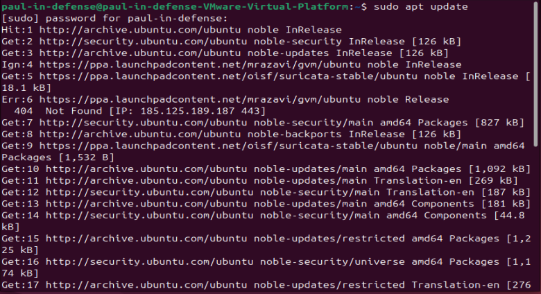
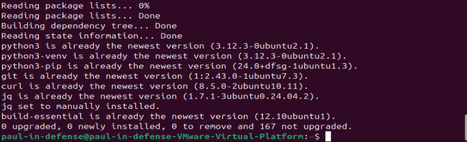
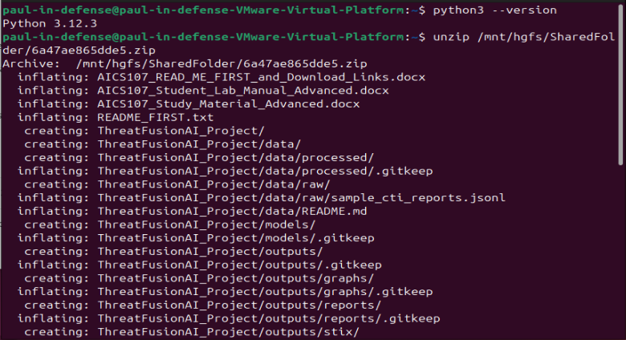
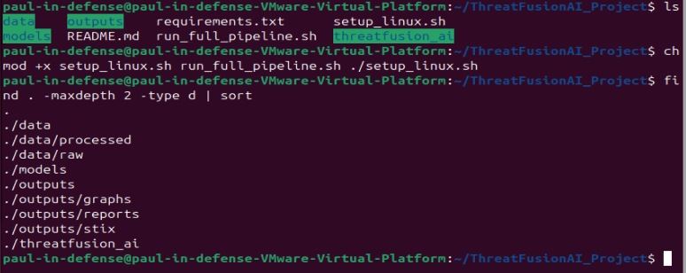
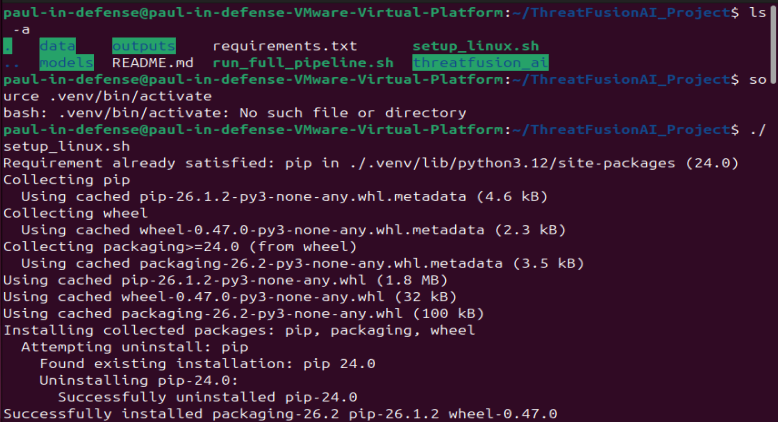
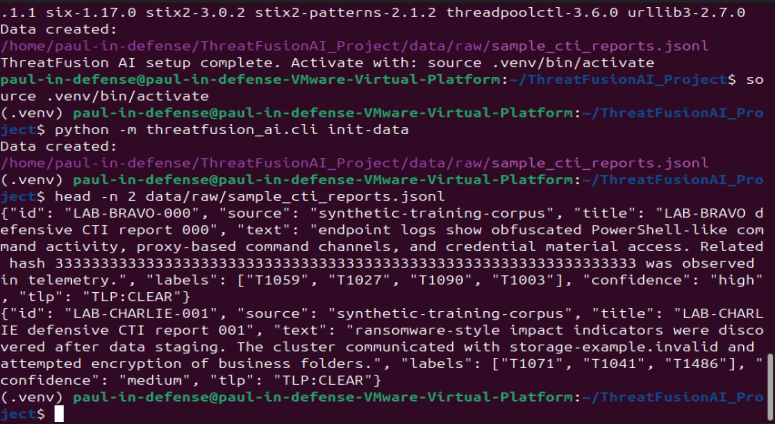
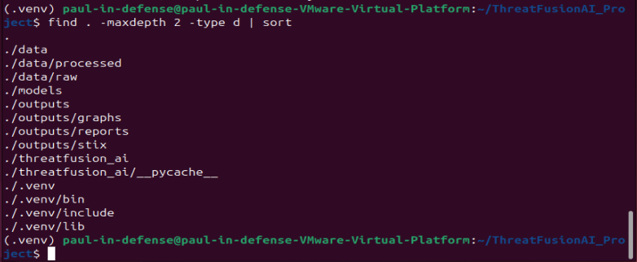

# ThreatFusion AI — Full Project Report

**Defensive Cyber Threat Intelligence Fusion Pipeline**
ICDFA AI-Driven Cybersecurity and Digital Forensics Fellowship — AICS-107

> ⚠️ Defensive training project only. All data is synthetic and safe. No real malicious URLs were visited, no malware samples were downloaded, and no intelligence produced here was used against any real system.

-----

## Table of Contents

- [Scenario](#scenario)
- [Priority Intelligence Requirements](#priority-intelligence-requirements)
- [Source Reliability Matrix](#source-reliability-matrix)
- [Methodology](#methodology)
  - [1. Environment Setup](#1-environment-setup)
  - [2. Intelligence Requirements & Source Matrix](#2-intelligence-requirements--source-matrix)
  - [3. IOC Extraction, Normalization & Safety Controls](#3-ioc-extraction-normalization--safety-controls)
  - [4. ATT&CK Mapping Model](#4-attck-mapping-model)
  - [5. Threat Knowledge Graph](#5-threat-knowledge-graph)
  - [6. Risk Scoring & Intelligence Prioritization](#6-risk-scoring--intelligence-prioritization)
  - [7. STIX 2.1 Export & Platform Mapping](#7-stix-21-export--platform-mapping)
  - [8. Analyst Report Generation](#8-analyst-report-generation)
- [Key Findings](#key-findings)
- [Recommendations](#recommendations)
- [Limitations](#limitations)
- [Future Work](#future-work)
- [Safety & Ethics](#safety--ethics)

-----

## Scenario

All analysis in this project is framed around a fictional organization: **Zenport Microfinance Bank**, a mid-size Nigerian digital-first microfinance bank. Framing the project around a specific organization is what turns raw IOC extraction into actual intelligence — every requirement, scoring decision, and recommendation in this report is written to support decisions this bank’s SOC team would realistically need to make.

## Priority Intelligence Requirements

**PIR-1 — Credential and Account Takeover Threats**

> What threat actors, malware families, or techniques are currently targeting Nigerian financial institutions to steal customer or staff credentials, and what specific indicators are associated with these campaigns?

- Decision supported: MFA enforcement priority, credential-monitoring alerts, phishing-awareness training budget
- Scope: Nigerian and West African financial sector, last 12 months
- Boundary: Technical/CTI indicators only — excludes physical security and insider threats

**PIR-2 — Ransomware Targeting Financial Services**

> Which ransomware families or affiliates have shown intent or capability to target banks/microfinance institutions in Nigeria or comparable emerging markets, and what are their known initial-access and impact behaviors?

- Decision supported: Backup/recovery investment priority, EDR tuning, IR tabletop planning
- Scope: African and emerging-market financial sector, last 12–18 months
- Boundary: Pre-encryption detection opportunities, not post-incident forensics

**PIR-3 — Command-and-Control and Exfiltration Infrastructure**

> What C2 infrastructure patterns and exfiltration techniques are being used against financial-sector targets, so detection rules can be built before data leaves the network?

- Decision supported: Network egress monitoring rules, DNS/proxy detection logic, SIEM correlation priority
- Scope: Global financial-sector threat intel, filtered for relevance to the organization’s stack
- Boundary: Network-layer indicators only

## Source Reliability Matrix

Ratings use the **Admiralty Scale (NATO System)** — a standard intelligence-community method that separately scores *source reliability* (A–F) and *information credibility* (1–6). The two are independent: a highly reliable source can still report something unconfirmed, and vice versa.

|Source              |Reliability|Credibility|Justification                                                                                         |
|--------------------|-----------|-----------|------------------------------------------------------------------------------------------------------|
|URLhaus             |B          |2          |Community-sourced, generally accurate, but unverified submissions occasionally produce false positives|
|AlienVault OTX      |B          |2          |Crowd-sourced pulses from vetted analysts; reliable for IOC volume, moderate on context depth         |
|MITRE ATT&CK        |A          |1          |Maintained by a trusted, well-funded nonprofit with a rigorous public vetting process                 |
|Vendor reports      |A          |1          |Backed by named analysts, incident response data, and reputational stakes in accuracy                 |
|Internal SIEM alerts|A          |2          |First-party observed data; fully reliable source, though alerts can be false positives pending triage |
|Endpoint telemetry  |A          |1          |Direct, first-party observed data from EDR agents — highest-confidence internal source                |

-----

## Methodology

### 1. Environment Setup

Started by updating the VM and installing the necessary tools:

```bash
sudo apt update
```


```bash
sudo apt install -y python3 python3-venv python3-pip git curl jq build-essential 
```



`python3`, `pip`, and `jq` were required from the start — `jq` in particular for reading the STIX JSON output cleanly later in the project.

The lab dependency pack was made accessible to the VM by placing it in the VMware shared folder and unzipping it there so the VM could reach it:

```bash
cd /mnt/hgfs/SharedFolder
unzip 6a47ae865dde5.zip
```


Changed into the project directory where the lab work would be carried out:

```bash
cd ThreatFusionAI_Project
ls
```


Changed the permissions on the setup dependencies to make them executable:

```bash
chmod +x setup_linux.sh run_full_pipeline.sh
```


Ran the setup script to build the Python virtual environment and install all project dependencies:

```bash
./setup_linux.sh
```


Activated the virtual environment:

```bash
source .venv/bin/activate
```


Generated the safe, synthetic CTI dataset to work with:

```bash
python -m threatfusion_ai.cli init-data
```

Used the following command to eyeball the first two sample records and confirm the data generated correctly:

```bash
head -n 2 data/raw/sample_cti_reports.jsonl
```

Confirmed completion of the setup by checking the project folder structure:

```bash
find . -maxdepth 2 -type d | sort
```

-----

### 2. Intelligence Requirements & Source Matrix

Defined three Priority Intelligence Requirements for the financial organization scenario and built a source matrix with reliability and credibility ratings — see [Priority Intelligence Requirements](#priority-intelligence-requirements) and [Source Reliability Matrix](#source-reliability-matrix) above.

-----

### 3. IOC Extraction, Normalization & Safety Controls

Ran the IOC extractor, which pulls indicators such as IPs, domains, URLs, and hashes out of raw report text:

```bash
python -m threatfusion_ai.cli run-pipeline
cat data/processed/enriched_cases.jsonl | head -n 3
```

**Defanging vs. refanging:** based on what the extracted data showed, defanged indicators are written in a deliberately broken form — e.g. `hxxp[://]evil[.]com` instead of `http://evil.com` — so they cannot be accidentally clicked, resolved, or trigger security tooling when shared in a report. Refanging (converting a defanged indicator back into its real, usable form) should only ever happen inside matching or analysis code — for example, when the pipeline needs to check an indicator against a live blocklist — and never in a browser or anything capable of connecting to it. This is standard CTI hygiene: analysts routinely share defanged indicators in written reports specifically so nobody on the distribution list accidentally interacts with a live malicious resource.

Added one new synthetic report to the raw dataset, following the same JSON format as the existing entries:

```bash
nano data/raw/sample_cti_reports.jsonl
```

The report added:

```json
{"id": "LAB-DELTA-000", "source": "synthetic-training-corpus", "title": "LAB-DELTA defensive CTI report 000", "text": "Suspicious outbound connections were observed to a staging host at 203.0.113.45. Phishing emails delivered a macro-enabled document that attempted to establish persistence via a scheduled task. Analysts also observed brute-force login attempts against a public-facing service.", "labels": ["T1566", "T1053", "T1110"], "confidence": "medium", "tlp": "TLP:CLEAR"}
```

The IP `203.0.113.45` was deliberately chosen from the IANA-reserved documentation range (`203.0.113.0/24`), which can never resolve to a real host — safe by design, not by luck.

> **Bug encountered:** the first attempt to add this line via `nano` produced a `JSONDecodeError: Expecting value: line 1 column 428` on the next pipeline run. The line had been corrupted during editing. This was diagnosed by validating every line in the file with a short Python script:
> 
> ```python
> import json
> with open('data/raw/sample_cti_reports.jsonl') as f:
>     for i, line in enumerate(f, 1):
>         line = line.strip()
>         if not line:
>             continue
>         try:
>             json.loads(line)
>         except json.JSONDecodeError as e:
>             print(f'BROKEN at line {i}: {e}')
> ```
> 
> This identified line 61 as broken. It was deleted (`sed -i '61d' data/raw/sample_cti_reports.jsonl`) and the report was re-added using `echo '...' >> data/raw/sample_cti_reports.jsonl` instead of an interactive editor — this writes the line atomically in one shot, avoiding the terminal-width line-wrapping issue that caused the original corruption.

Re-ran the pipeline and confirmed the new report was extracted correctly:

```bash
python -m threatfusion_ai.cli run-pipeline
grep -A 5 "LAB-DELTA-000" data/processed/enriched_cases.jsonl
```

This command re-processes the full dataset (including the new LAB-DELTA-000 entry) through the extraction pipeline, then filters the enriched output to show only the new report’s record plus the five lines following it — confirming its IOC (`203.0.113.45`) and ATT&CK labels were extracted and structured correctly, the same way every other report in the dataset was.

-----

### 4. ATT&CK Mapping Model

Trained the baseline classifier:

```bash
python -m threatfusion_ai.cli train
```

Viewed the output:

```bash
cat outputs/model_evaluation.txt
```

This trains a multi-label model on the synthetic reports to predict MITRE ATT&CK techniques from report text — “multi-label” because a single report frequently maps to several techniques at once (e.g. one intrusion chain spanning initial access, execution, and exfiltration).

Discovered a **Macro F1 of 0.7825**, a reasonable score for a small synthetic dataset. Macro F1 averages performance equally across all techniques regardless of how common they are, which exposes weak performance on rare techniques instead of letting it hide behind strong performance on common ones.

|Technique       |Precision|Recall|F1-score|Support|
|----------------|---------|------|--------|-------|
|T1003           |1.00     |1.00  |1.00    |7      |
|T1027           |1.00     |1.00  |1.00    |7      |
|T1041           |0.89     |1.00  |0.94    |8      |
|T1053           |1.00     |0.75  |0.86    |4      |
|T1059           |0.91     |1.00  |0.95    |10     |
|T1071           |1.00     |1.00  |1.00    |8      |
|T1090           |1.00     |1.00  |1.00    |7      |
|T1105           |0.00     |0.00  |0.00    |0      |
|T1110           |0.00     |0.00  |0.00    |1      |
|T1486           |1.00     |1.00  |1.00    |5      |
|T1566           |1.00     |0.75  |0.86    |4      |
|**Macro avg**   |0.80     |0.77  |0.78    |61     |
|**Weighted avg**|0.95     |0.95  |0.95    |61     |

Found five weak predictions:

1. **T1105** — precision/recall/F1 all 0.00, support = 0. No test examples existed for this technique at all, so the model was never meaningfully evaluated on it.
1. **T1110** — precision/recall/F1 all 0.00, support = 1. Only one example existed and the model missed it entirely — severe class imbalance.
1. **T1053** — recall 0.75, F1 0.86, support = 4. Perfect precision but reduced recall — the model is too conservative and misses some real instances, likely due to small support.
1. **T1059** — precision 0.91, F1 0.95, support = 10. Recall is perfect but precision dips slightly, suggesting the model occasionally over-predicts T1059 — likely because its language overlaps with T1027 (Obfuscation) in report text.
1. **T1566** — recall 0.75, F1 0.86, support = 4. Same small-support pattern as T1053 — only 4 training examples limits reliable generalization.

Common root cause across all five: low *support* (few training/test examples). This is the central limitation of the current model.

-----

### 5. Threat Knowledge Graph

Built a threat knowledge graph — ran the pipeline and located the graph output:

```bash
python -m threatfusion_ai.cli run-pipeline
ls outputs/graphs/
cat outputs/campaign_clusters.json
```

The graph connects reports, IOCs, and ATT&CK techniques as nodes, so relationships between them become visible — specifically, a **case** node (the report), **attack-technique** nodes, and **IOC** nodes (e.g. a sha256 hash), connected by edges representing which techniques and indicators each report exhibited.

**Steps to view the graph:**

Copied the graph file into the VM’s shared folder:

```bash
cp outputs/graphs/threat_knowledge_graph.graphml /mnt/hgfs/SharedFolder/
```

Installed [yEd](https://www.yworks.com/products/yed) on the host machine to view the graph, since GraphML rendering needs a proper desktop GUI tool rather than anything available inside the VM terminal.

Opened the graph file in yEd and applied an automatic **Organic** layout (Layout → Organic) to make it readable, since the default layout piles nodes on top of each other.

**Graph interpretation:**

`campaign_clusters.json` reported a single cluster containing all 61 reports, and the rendered graph confirmed this visually — rather than showing visually separate campaign groups, it rendered as one dense, tangled mass of interconnected nodes, with only a handful of nodes sitting more loosely on the outer periphery.

This happened because the dataset draws from a small pool of roughly 11 ATT&CK techniques spread across 61 reports. With that few techniques shared across that many reports, almost every report ends up connected to almost every other report through at least one shared technique, causing the clustering algorithm to merge nearly everything into one component instead of finding distinct, separated campaigns. This is best understood as a limitation of the synthetic dataset’s technique diversity rather than a flaw in the clustering method itself — a real-world dataset, where reports would share not just techniques but specific shared infrastructure (the same C2 domain, the same file hash), would be expected to produce visibly separated, tighter sub-clusters instead of one dense web.

-----

### 6. Risk Scoring & Intelligence Prioritization

Located and reviewed the scoring logic:

```bash
grep -rl "risk_score\|severity" threatfusion_ai/
cat threatfusion_ai/scoring.py
```

The original scoring logic computed a case’s risk score as:

```python
score = min(100, 20 + technique_weight + high_impact + c2 + ioc_weight)
```

Where `technique_weight` scales with the number of techniques present, `high_impact` adds +20 if ransomware impact (T1486) is present, and `c2` adds +12 if any Command-and-Control technique (T1071, T1090, T1105) is present. This rewarded ransomware impact and C2 presence, but had no specific weighting for credential theft or exfiltration — a gap, given that Zenport Microfinance Bank’s PIRs explicitly prioritize both (PIR-1 and PIR-3).

Saved a snapshot of the risk scores before the weight changes, so there would be something to compare against:

```bash
cp data/processed/enriched_cases.jsonl data/processed/enriched_cases_BEFORE.jsonl
```

Edited `scoring.py`. The scoring function was located inside the file using the `grep -rl` search above, which narrowed six files containing “risk_score” or “severity” down to the one file (`scoring.py`) that actually calculates the score, as opposed to files that only display or export it (`reporting.py`, `stix_exporter.py`). Two new lines were added directly after the existing `c2` bonus line:

```python
credential_theft = 18 if {'T1003','T1110'} & set(techniques) else 0
exfil_bonus = 14 if 'T1041' in techniques else 0
```

And the final score calculation was updated to include them:

```python
score = min(100, 20 + technique_weight + high_impact + c2 + credential_theft + exfil_bonus + ioc_weight)
```

Re-ran the pipeline using the edited `scoring.py`, generating fresh scores with the new credential-theft and exfiltration bonuses applied:

```bash
python -m threatfusion_ai.cli run-pipeline
```

Once that was done, pulled a quick side-by-side look at a few cases:

```bash
grep -A 2 "LAB-BRAVO-000" data/processed/enriched_cases_BEFORE.jsonl
grep -A 2 "LAB-BRAVO-000" data/processed/enriched_cases.jsonl
```

This shows the report’s risk score before vs. after the changes, confirming the new weights actually took effect:

|Case           |Techniques                |Before         |After              |Change|Reason                                                                           |
|---------------|--------------------------|---------------|-------------------|------|---------------------------------------------------------------------------------|
|LAB-BRAVO-000  |T1003, T1027, T1059, T1090|92.2 (critical)|**100** (critical) |+7.8  |Contains T1003 → triggered new credential-theft bonus, hit the score cap         |
|LAB-CHARLIE-001|T1071, T1041, T1486       |80.7 (critical)|**94.7** (critical)|+14.0 |Contains T1041 → triggered new exfiltration bonus exactly as designed            |
|LAB-CHARLIE-002|T1071, T1041, T1486       |80.7 (critical)|**94.7** (critical)|+14.0 |Same technique set as CHARLIE-001 — confirms the change is consistent, not random|

All three were already labeled “critical” under the original flat severity bands, but the numeric separation now reflects the organization’s actual risk priorities — credential-access and exfiltration cases score meaningfully higher than generic ones, instead of clustering near the same number.

-----

### 7. STIX 2.1 Export & Platform Mapping

STIX (Structured Threat Information Expression) is an industry-standard JSON format for sharing threat intelligence between platforms.

Generated the STIX bundle:

```bash
python -m threatfusion_ai.cli run-pipeline
jq ".objects[0:5]" outputs/stix/threatfusion_bundle.json
jq '.objects[] | select(.type=="indicator")' outputs/stix/threatfusion_bundle.json
```

The first `jq` command previews the first five objects in the bundle. The second command was run to filter the whole bundle for just `indicator`-type objects instead of the first five, so the actual `pattern` field could be seen — the first five objects happened to be the report and four attack-pattern objects, so the indicator objects needed a targeted filter to surface.

**Confirmed object types in the bundle:**

|Object Type     |Example ID                        |Key Detail                                                                                   |
|----------------|----------------------------------|---------------------------------------------------------------------------------------------|
|`report`        |`report--e28ba443ef85c385`        |“LAB-BRAVO defensive CTI report 000”, labeled critical                                       |
|`attack-pattern`|`attack-pattern--73bc055e835d5575`|T1003 (Credential Access), linked to MITRE ATT&CK via `external_references`                  |
|`attack-pattern`|`attack-pattern--d5f68c3e3583197a`|T1059 (Execution)                                                                            |
|`indicator`     |`indicator--3f05c6b25bd17fd9`     |SHA-256 pattern `[file:hashes.'SHA-256' = '333...333']`, labeled `training-do-not-touch-live`|
|`indicator`     |`indicator--68cfa2f0e143b0c3`     |Domain indicator                                                                             |

The `indicator` object’s `pattern` field uses **STIX Pattern syntax** — a standardized, machine-readable matching language that lets any STIX-compliant tool automatically match the indicator against live telemetry without custom per-platform parsing logic.

**Platform sharing plan:**

- **OpenCTI** would ingest these objects natively — the `report` object becomes a Report entity, `attack-pattern` objects populate its ATT&CK knowledge base view, and `indicator` objects are automatically linked back to their source report and technique, recreating the same relationships visible in the Section 5 knowledge graph.
- **MISP** would import this bundle as an Event, converting each `indicator` pattern into a MISP attribute (the SHA-256 hash becomes a file-hash attribute) and each `attack-pattern` into a MITRE ATT&CK galaxy tag.
- Both platforms preserve labels such as `training-do-not-touch-live`, ensuring safety context isn’t lost when intelligence moves between systems.

-----

### 8. Analyst Report Generation

At least three analyst reports were generated using the commands:

```bash
python -m threatfusion_ai.cli report --case-id LAB-ALPHA
python -m threatfusion_ai.cli report --case-id LAB-BRAVO
python -m threatfusion_ai.cli report --case-id LAB-CHARLIE
```

The three reports were reviewed using:

```bash
cat outputs/reports/LAB-ALPHA-007_intel_report.md
cat outputs/reports/LAB-BRAVO-000_intel_report.md
cat outputs/reports/LAB-CHARLIE-001_intel_report.md
```

The highest-severity case, **LAB-BRAVO-000** (risk score 100 after the Section 6 weighting changes), was rewritten for two audiences to demonstrate the same intelligence communicated differently depending on the reader.

**Executive version**

> **Subject: Credential Theft Attempt via Obfuscated Command Activity — Critical Risk**
> 
> We detected an attacker running disguised commands on an internal system, attempting to access stored credentials, and communicating with an external server through a hidden channel. This is our highest-severity finding to date (risk score: 100/100).
> 
> **Business impact:** Credential theft is the most direct path to account takeover and fraudulent transactions at a financial institution. If real, this indicates an active attempt to gain the access needed to move money or access customer accounts.
> 
> **Confidence:** Moderate-High — internal endpoint telemetry (Admiralty A1) plus a corroborating file hash indicator.
> 
> **Limitations:** Detected in a training/synthetic environment; requires validation against live SIEM/EDR data before triggering incident response.
> 
> **Recommended actions:** Treat as top priority for validation given the maximum risk score; if confirmed live, immediately isolate affected endpoints and force credential resets.

**Technical version**

> **Case:** LAB-BRAVO-000 | **Severity:** Critical | **Risk Score:** 100 | **TLP:** CLEAR
> 
> **ATT&CK chain:** T1059 (Execution) → T1027 (Defense Evasion — Obfuscation) → T1003 (Credential Access) → T1090 (Command and Control)
> 
> **Indicators:** `sha256: 333...333` (labeled `training-do-not-touch-live`)
> 
> **Suggested detection logic:**
> 
> - Alert on script-interpreter processes with high-entropy or obfuscation markers in command-line arguments (T1027 + T1059)
> - Monitor for LSASS memory access or credential-store file reads shortly after suspicious script execution (T1003)
> - Flag proxy/DNS traffic with irregular beacon intervals following the above sequence (T1090)
> - Match the SHA-256 hash against endpoint file-write/execution events
> 
> **Confidence:** Moderate-High (Admiralty A1 — first-party EDR telemetry)
> 
> **Limitations:** Synthetic data; not yet validated against production telemetry; scoring reflects the financial-sector-weighted model from Section 6.
> 
> **Recommended actions:**
> 
> 1. Validate the hash and behavior chain against live EDR/SIEM data immediately
> 1. If confirmed, isolate the host and initiate credential resets
> 1. Open a detection-engineering ticket for the T1027→T1003 pattern

-----

## Key Findings

- **Highest-risk case:** `LAB-BRAVO-000` — obfuscated command execution + credential access, risk score 100/100 after weighting adjustments
- **Model performance:** Macro F1 0.7825; strong on well-represented techniques, unreliable on techniques with fewer than ~4 training examples
- **Graph structure:** all 61 reports form one connected cluster — a direct consequence of limited technique diversity in the synthetic dataset, not a clustering failure
- **Risk scoring:** customizing weights for credential-theft (+18) and exfiltration (+14) techniques changed relative case prioritization by up to +14 points, better reflecting a financial institution’s actual risk tolerance than the original generic weights

## Recommendations

**SOC / Immediate**

- Validate `LAB-BRAVO-000`-pattern indicators against live SIEM/EDR telemetry as top priority
- Hunt for the T1027→T1003 obfuscation-then-credential-access chain across endpoint, DNS, and auth logs

**Incident Response**

- If BRAVO-pattern activity is confirmed live, isolate affected hosts and force credential resets immediately
- Validate exfiltration-flagged cases against DNS/proxy egress logs before dismissing as false positives

**Detection Engineering**

- Convert validated ATT&CK mappings into detection backlog tickets, prioritizing the credential-access and exfiltration chains identified above
- Build DNS/proxy beaconing detection rules targeting the recurring C2 (T1071/T1090) pattern

**Management**

- Approve MFA enforcement and credential-monitoring budget in line with PIR-1
- Review backup/recovery investment in line with PIR-2, given ransomware-impact (T1486) cases in the dataset

## Limitations

- **Small synthetic dataset** (61 reports) — all findings require validation against real telemetry before any operational use
- **Limited technique diversity** (~11 ATT&CK techniques) — directly caused both the model’s weak performance on rare techniques and the knowledge graph’s single-cluster result
- **Zero/near-zero test support** for T1105 and T1110 — the classifier is effectively unevaluated for these techniques
- **Technique confusion** between T1059 (Execution) and T1027 (Obfuscation) due to overlapping language in report text
- **Designer-chosen risk weights** — the credential-theft (+18) and exfiltration (+14) bonuses reflect one analyst’s judgment of Zenport Microfinance Bank’s priorities, not a validated stakeholder consensus
- **No live-feed validation performed** — optional live enrichment (URLhaus/OTX) was skipped due to lack of confirmed instructor authorization

## Future Work

- Expand the synthetic dataset with more diverse ATT&CK technique coverage to improve model reliability and graph cluster resolution
- Validate risk-scoring weights with actual SOC/risk stakeholders rather than by designer judgment alone
- Pursue an embedding-based recommender (sentence-transformer cosine similarity against ATT&CK technique descriptions) as a semantic complement to the baseline classifier, particularly for low-support techniques
- If authorized, complete live-feed enrichment under proper safety controls
- Convert validated ATT&CK mappings into formal detection-engineering backlog tickets with log sources, fields, and test methods defined

## Safety & Ethics

- All indicators use IANA-reserved documentation ranges (`203.0.113.0/24`, `.invalid`, `.test`) that cannot resolve to real infrastructure
- Indicators are defanged in all written output; refanging happens only inside matching/analysis code, never in a browser
- No live malicious URLs were visited and no malware samples were downloaded at any point
- Optional live-feed enrichment was skipped rather than performed without confirmed authorization
- All records carry a TLP (Traffic Light Protocol) marking
- STIX indicator objects are explicitly labeled `training-do-not-touch-live` to prevent accidental misuse if this data were ever exported elsewhere

-----

*Built as part of the ICDFA AI-Driven Cybersecurity and Digital Forensics Fellowship (AICS-107). For authorized defensive training purposes only.*